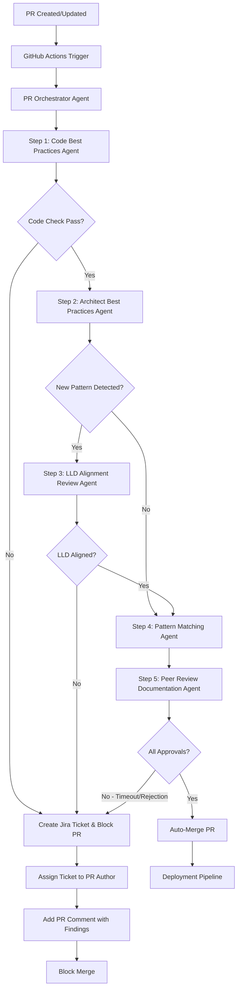
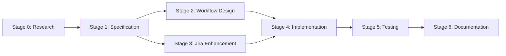

# Project Plan: GitHub PR Automated Peer Review System with Jira Integration

## PROJECT STATUS

| Status | Phase | Completion |
|--------|-------|------------|
| **COMPLETE** | Delivered | 100% |

**Active Stage**: None - Project Complete
**Current Activity**: All deliverables completed
**Blockers**: None

---

## Section 1: Project Tracking Table

### Overall Progress
```
[████████████████████] 100%
```

### Stage Progress

| Stage | Name | Status | Workers | Progress |
|-------|------|--------|---------|----------|
| 0 | Research & Analysis | ✅ COMPLETE | 3 | 100% |
| 1 | Agent Specification Design | ✅ COMPLETE | 2 | 100% |
| 2 | GitHub Actions Workflow Design | ✅ COMPLETE | 2 | 100% |
| 3 | Jira Agent Enhancement | ✅ COMPLETE | 2 | 100% |
| 4 | Agent Implementation | ✅ COMPLETE | 4 | 100% |
| 5 | Integration & Testing | ✅ COMPLETE | 3 | 100% |
| 6 | Documentation & Delivery | ✅ COMPLETE | 2 | 100% |

**Status Legend**: ✅ COMPLETE | 🟡 IN_PROGRESS | 🔄 BLOCKED | ⏳ PENDING

---

## Section 2: Project Overview

### 2.1 Project Goal
Implement an automated peer review system triggered by GitHub Pull Requests that:
1. Automatically runs peer review agents on committed components
2. Validates code against all defined quality checks (Code Best Practices, Architect Best Practices, LLD Alignment, Pattern Matching)
3. **Allows merge** if all checks pass
4. **Blocks merge and creates Jira ticket** if any check fails, with the ticket assigned to the PR author

### 2.2 Key Objectives

1. **GitHub PR Trigger Integration**
   - Configure GitHub Actions workflow to trigger on `pull_request` events (opened, synchronize)
   - Orchestrate all peer review agents in sequence
   - Implement pass/fail gate logic for merge decisions

2. **Automated Agent Pipeline**
   - Execute agents in correct order: Code Best Practices → Architect Best Practices → LLD Alignment → Pattern Matching → Peer Review Documentation
   - Aggregate results from all agents
   - Generate comprehensive review report

3. **Jira Ticket Automation**
   - Enhance Jira Integration Agent with auto-assignment to PR author
   - Create tickets with full context (which check failed, detailed findings, remediation guidance)
   - Link tickets bidirectionally to GitHub PR

4. **Merge Decision Automation**
   - Implement GitHub branch protection rules
   - Auto-approve/merge when all checks pass
   - Block merge with detailed failure report when checks fail

### 2.3 Success Criteria

| Criterion | Target | Measurement Method |
|-----------|--------|-------------------|
| PR trigger latency | < 5 seconds | GitHub Actions logs |
| Full pipeline execution | < 2 minutes | End-to-end timing |
| Jira ticket creation | 100% on failure | Audit logs |
| Auto-merge on pass | 100% success rate | GitHub merge logs |
| False positive rate | < 5% | Manual review sampling |

---

## Section 3: Process Architecture

### 3.1 High-Level Workflow



### 3.2 New Components Required

| Component | Type | Purpose |
|-----------|------|---------|
| PR Orchestrator Agent | New Agent | Coordinates all agents, aggregates results, makes merge decision |
| GitHub Actions Workflow | New Workflow | YAML definition for PR trigger and agent execution |
| Jira Skill Enhancement | Enhancement | Auto-assignment to PR author with context |
| Merge Gate Logic | New Logic | Pass/fail determination based on all agent results |

---

## Section 4: Stage-by-Stage Execution Plan

### Stage 0: Research & Analysis
**Objective**: Understand existing system, identify gaps, research best practices

**Workers**:
| Worker | Task | Output |
|--------|------|--------|
| worker-1-existing-analysis | Analyze existing agents, identify integration points | `analysis_report.md` |
| worker-2-github-actions-research | Research GitHub Actions best practices for agent orchestration | `github_actions_research.md` |
| worker-3-jira-automation-research | Research Jira automation patterns for PR-triggered tickets | `jira_automation_research.md` |

**Success Criteria**:
- Complete understanding of existing agent APIs and interfaces
- GitHub Actions workflow patterns documented
- Jira ticket creation API requirements documented

---

### Stage 1: Agent Specification Design
**Objective**: Design the PR Orchestrator Agent specification using the 10-question framework

**Workers**:
| Worker | Task | Output |
|--------|------|--------|
| worker-1-orchestrator-spec | Create PR Orchestrator Agent specification | `pr_orchestrator_agent_spec.md` |
| worker-2-jira-enhancement-spec | Design Jira agent enhancements for auto-assignment | `jira_agent_enhancement_spec.md` |

**Dependencies**: Stage 0 complete

**Success Criteria**:
- PR Orchestrator Agent fully specified (10-question framework)
- Jira Agent enhancement requirements documented
- All TBCs (To Be Confirmed) resolved or documented

---

### Stage 2: GitHub Actions Workflow Design
**Objective**: Design the GitHub Actions workflow for PR-triggered agent execution

**Workers**:
| Worker | Task | Output |
|--------|------|--------|
| worker-1-workflow-design | Design main workflow YAML structure | `peer_review_workflow.yml` |
| worker-2-branch-protection | Design branch protection rules and merge requirements | `branch_protection_config.md` |

**Dependencies**: Stage 1 complete

**Success Criteria**:
- Complete workflow YAML with all agent steps
- Branch protection configuration documented
- Error handling and retry logic defined

---

### Stage 3: Jira Agent Enhancement
**Objective**: Enhance Jira Integration Agent with PR author auto-assignment and rich context

**Workers**:
| Worker | Task | Output |
|--------|------|--------|
| worker-1-jira-agent-update | Update Jira Agent specification and implementation | `jira_integration_agent.md` (updated) |
| worker-2-jira-skill | Create Jira Skill for ticket operations | `skills/jira_ticket_skill.md` |

**Dependencies**: Stage 1 complete

**Success Criteria**:
- Jira Agent auto-assigns tickets to PR author
- Rich context included (agent name, findings, remediation)
- Jira Skill created for reusable ticket operations

---

### Stage 4: Agent Implementation
**Objective**: Implement all new and enhanced agents

**Workers**:
| Worker | Task | Output |
|--------|------|--------|
| worker-1-orchestrator-agent | Implement PR Orchestrator Agent | `agents/pr_orchestrator_agent.md` |
| worker-2-orchestrator-skill | Create Orchestrator Skill for pipeline execution | `skills/orchestrator_skill.md` |
| worker-3-jira-implementation | Implement enhanced Jira Agent | `agents/jira_integration_agent.md` (updated) |
| worker-4-workflow-implementation | Implement GitHub Actions workflow | `.github/workflows/peer_review.yml` |

**Dependencies**: Stages 2 and 3 complete

**Success Criteria**:
- All agents fully implemented following specification
- Skills created for reusable operations
- GitHub Actions workflow executable

---

### Stage 5: Integration & Testing
**Objective**: Test the complete pipeline end-to-end

**Workers**:
| Worker | Task | Output |
|--------|------|--------|
| worker-1-unit-testing | Test individual agents | `test_results/unit_tests.md` |
| worker-2-integration-testing | Test full pipeline integration | `test_results/integration_tests.md` |
| worker-3-failure-scenarios | Test failure scenarios and Jira ticket creation | `test_results/failure_tests.md` |

**Dependencies**: Stage 4 complete

**Success Criteria**:
- All agent unit tests pass
- End-to-end pipeline executes correctly
- Jira tickets created correctly on failures
- Auto-merge works on success

---

### Stage 6: Documentation & Delivery
**Objective**: Complete documentation and deliver final package

**Workers**:
| Worker | Task | Output |
|--------|------|--------|
| worker-1-documentation | Create comprehensive system documentation | `docs/system_documentation.md` |
| worker-2-deployment-guide | Create deployment and configuration guide | `docs/deployment_guide.md` |

**Dependencies**: Stage 5 complete

**Success Criteria**:
- Complete system documentation
- Deployment guide with step-by-step instructions
- Configuration templates provided

---

## Section 5: Technical Stack

| Category | Technology | Purpose |
|----------|------------|---------|
| CI/CD | GitHub Actions | Workflow automation, PR triggers |
| Issue Tracking | Jira (REST API v3) | Ticket creation, assignment |
| Knowledge Base | Confluence | Pattern library, LLD storage |
| Agent Framework | Claude/Agentic Framework | Agent definitions and execution |
| Monitoring | CloudWatch | Logging, metrics, alarms |
| Queue (Fallback) | AWS SQS | Retry queue for failed operations |

---

## Section 6: Project Folder Structure

```
tonic-peer-review-agent/
├── .github/
│   └── workflows/
│       └── peer_review.yml           # NEW: GitHub Actions workflow
├── agents/
│   ├── pr_orchestrator_agent.md      # NEW: Orchestrator agent
│   ├── code_best_practises_agent.md  # EXISTING
│   ├── architect_best_practises_agent.md  # EXISTING
│   ├── lld_alignment_review_agent.md # EXISTING
│   ├── pattern_matching_agent.md     # EXISTING
│   ├── peer_review_documentation_agent.md  # EXISTING
│   └── jira_integration_agent.md     # ENHANCED
├── skills/
│   ├── orchestrator_skill.md         # NEW: Pipeline orchestration skill
│   └── jira_ticket_skill.md          # NEW: Jira ticket operations skill
├── specs/
│   └── pr_orchestrator_agent_spec.md # NEW: Orchestrator specification
├── docs/
│   ├── system_documentation.md       # NEW: System docs
│   └── deployment_guide.md           # NEW: Deployment guide
└── .claude/
    └── plans/
        └── project-plan-1/           # This project plan
```

---

## Section 7: Key Design Decisions

| Decision | Choice | Rationale |
|----------|--------|-----------|
| Agent orchestration pattern | Sequential with conditional branching | Matches existing workflow, allows fail-fast |
| Merge blocking mechanism | GitHub branch protection + status checks | Native GitHub integration, reliable |
| Jira ticket assignment | Auto-assign to PR author | Direct accountability, faster resolution |
| Failure aggregation | Create single ticket with all failures | Reduces ticket noise, comprehensive view |
| Retry mechanism | SQS queue with exponential backoff | Existing pattern in Jira agent, proven reliable |

---

## Section 8: Testing Strategy

| Test Type | Scope | Method |
|-----------|-------|--------|
| Unit Testing | Individual agents | Mock inputs, verify outputs |
| Integration Testing | Agent-to-agent communication | Staged PR tests |
| End-to-End Testing | Full pipeline | Real PR with test repository |
| Failure Testing | Jira ticket creation | Intentionally fail checks |
| Performance Testing | SLA compliance | Timing measurements |

---

## Section 9: Success Metrics

| Metric | Target | Measurement |
|--------|--------|-------------|
| Automation coverage | 100% of PRs | GitHub Actions logs |
| Check execution time | < 2 minutes total | Pipeline timing |
| Jira ticket accuracy | 100% on failures | Audit comparison |
| False positive rate | < 5% | Weekly manual review |
| Developer satisfaction | > 80% | Survey after 30 days |

---

## Section 10: Stage Dependencies



---

## Section 11: Notes and Assumptions

### Assumptions
1. Existing agents (Code Best Practices, Architect, LLD, Pattern Matching, Peer Review) are fully functional
2. GitHub Actions is enabled on the repository
3. Jira and Confluence integrations are already configured with valid credentials
4. CloudWatch logging infrastructure is in place
5. Branch protection rules can be configured on the target repository

### Notes
1. The PR Orchestrator Agent is a new coordinating agent that doesn't replace existing agents
2. The Jira Skill provides reusable ticket creation functionality that can be used by any agent
3. Auto-merge requires appropriate GitHub permissions (admin or write with branch protection bypass)
4. The system should support manual override for exceptional cases

### TBCs (To Be Confirmed)
1. **TBC-1**: Should failed PRs be auto-closed or left open for fixing?
2. **TBC-2**: What is the timeout for the complete pipeline (suggested: 10 minutes)?
3. **TBC-3**: Should Slack/Teams notifications be added for failures?
4. **TBC-4**: What repository/repositories will this be deployed to first?

---

## Section 12: Project Completion Criteria

The project is complete when:
- [ ] PR Orchestrator Agent is fully implemented and tested
- [ ] GitHub Actions workflow is deployed and functional
- [ ] Jira Integration Agent is enhanced with auto-assignment
- [ ] Jira Skill is created and functional
- [ ] End-to-end pipeline passes all test scenarios
- [ ] Documentation is complete
- [ ] System is deployed to at least one target repository

---

## Approval Required

**Please review this project plan and respond with:**
- `go` / `approved` / `continue` - to proceed with execution
- Or provide feedback for modifications

**Estimated Duration**:
- Research to completion: 7 stages
- Can be parallelized: Stages 2 and 3 can run in parallel after Stage 1
