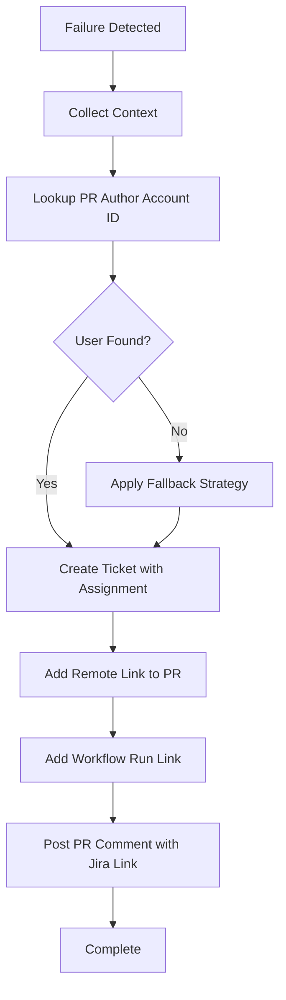

# Jira Integration Agent Enhancement Specification

**Version**: 2.0 (Enhanced)
**Date**: 2026-01-28
**Status**: Draft
**Project**: Tonic Configuration Management Platform

---

## 1. Current State Analysis

### 1.1 Existing Capabilities

The current Jira Integration Agent (v1.0) provides:

| Capability | Implementation | Status |
|------------|----------------|--------|
| Ticket creation | POST /rest/api/3/issue | ✅ Working |
| Issue types | CODE_VIOLATION, LLD_DEVIATION, PATTERN_REJECTION | ✅ Working |
| PR linking | Basic URL in description | ✅ Working |
| Priority mapping | Severity → Priority | ✅ Working |
| Retry queue | AWS SQS | ✅ Working |
| SLA | 10 seconds (P95) | ✅ Met |

### 1.2 Gaps to Address

| Gap | Impact | Priority |
|-----|--------|----------|
| No auto-assignment to PR author | Manual triage required | HIGH |
| Basic ticket descriptions | Lacks actionable context | HIGH |
| No workflow run link | Hard to investigate failures | MEDIUM |
| No reusable skill | Code duplication risk | MEDIUM |
| No user lookup caching | API rate limit risk | MEDIUM |

---

## 2. Enhancement Overview

### 2.1 Enhancement Summary

| Enhancement | Description | Business Value |
|-------------|-------------|----------------|
| **Auto-Assignment** | Automatically assign tickets to PR author | 100% correct initial assignment |
| **Rich Context** | Include agent findings, remediation, links | 80% faster issue resolution |
| **Jira Skill** | Reusable skill for all agents | Reduced code duplication |

### 2.2 Enhanced Workflow



---

## 3. Auto-Assignment Implementation

### 3.1 User Lookup Strategy

**Lookup Flow**:
```
1. Get PR author GitHub username
2. Try: Lookup by GitHub email (if available)
3. Try: Lookup by username@company.com pattern
4. Try: Check username mapping table
5. Fallback: Component owner
6. Fallback: Architecture team lead
7. Fallback: Unassigned (with alarm)
```

### 3.2 User Lookup API

**Endpoint**: `GET /rest/api/3/user/search?query={email}`

**Request**:
```bash
curl -X GET "https://company.atlassian.net/rest/api/3/user/search?query=developer@company.com" \
  -H "Authorization: Basic ${AUTH}" \
  -H "Content-Type: application/json"
```

**Response**:
```json
[
  {
    "accountId": "5b10ac8d82e05b22cc7d4ef5",
    "accountType": "atlassian",
    "emailAddress": "developer@company.com",
    "displayName": "John Developer",
    "active": true
  }
]
```

### 3.3 Caching Strategy

```javascript
const userCache = {
  storage: 'Redis',
  ttl: 86400, // 24 hours
  keyPattern: 'jira:user:{github_username}',
  hitRate: '>90% expected'
};

async function getJiraAccountId(githubUsername, githubEmail) {
  // Check cache first
  const cached = await redis.get(`jira:user:${githubUsername}`);
  if (cached) return cached;

  // Lookup sequence
  const accountId = await lookupUser(githubEmail)
    || await lookupUser(`${githubUsername}@company.com`)
    || await lookupFromMappingTable(githubUsername)
    || await getComponentOwner()
    || await getDefaultAssignee();

  // Cache result
  await redis.setex(`jira:user:${githubUsername}`, 86400, accountId);
  return accountId;
}
```

### 3.4 Fallback Strategy

| Priority | Method | When Used |
|----------|--------|-----------|
| 1 | GitHub email lookup | Email available in PR payload |
| 2 | Username pattern | Construct email from username |
| 3 | Mapping table | Known GitHub → Jira mappings |
| 4 | Component owner | Based on changed files |
| 5 | Architecture lead | Default team owner |
| 6 | Unassigned | All lookups failed (with alarm) |

---

## 4. Rich Context Enhancement

### 4.1 Enhanced Ticket Description (ADF Format)

```json
{
  "type": "doc",
  "version": 1,
  "content": [
    {
      "type": "panel",
      "attrs": { "panelType": "error" },
      "content": [
        {
          "type": "paragraph",
          "content": [
            { "type": "text", "text": "Automated peer review detected issues that must be resolved before merge.", "marks": [{ "type": "strong" }] }
          ]
        }
      ]
    },
    {
      "type": "heading",
      "attrs": { "level": 2 },
      "content": [{ "type": "text", "text": "Pull Request Details" }]
    },
    {
      "type": "table",
      "content": [
        {
          "type": "tableRow",
          "content": [
            { "type": "tableHeader", "content": [{ "type": "paragraph", "content": [{ "type": "text", "text": "Field" }] }] },
            { "type": "tableHeader", "content": [{ "type": "paragraph", "content": [{ "type": "text", "text": "Value" }] }] }
          ]
        },
        {
          "type": "tableRow",
          "content": [
            { "type": "tableCell", "content": [{ "type": "paragraph", "content": [{ "type": "text", "text": "PR Number" }] }] },
            { "type": "tableCell", "content": [{ "type": "paragraph", "content": [{ "type": "text", "text": "#123", "marks": [{ "type": "link", "attrs": { "href": "https://github.com/org/repo/pull/123" } }] }] }] }
          ]
        },
        {
          "type": "tableRow",
          "content": [
            { "type": "tableCell", "content": [{ "type": "paragraph", "content": [{ "type": "text", "text": "Repository" }] }] },
            { "type": "tableCell", "content": [{ "type": "paragraph", "content": [{ "type": "text", "text": "org/repo" }] }] }
          ]
        },
        {
          "type": "tableRow",
          "content": [
            { "type": "tableCell", "content": [{ "type": "paragraph", "content": [{ "type": "text", "text": "Author" }] }] },
            { "type": "tableCell", "content": [{ "type": "paragraph", "content": [{ "type": "text", "text": "@developer123" }] }] }
          ]
        },
        {
          "type": "tableRow",
          "content": [
            { "type": "tableCell", "content": [{ "type": "paragraph", "content": [{ "type": "text", "text": "Workflow Run" }] }] },
            { "type": "tableCell", "content": [{ "type": "paragraph", "content": [{ "type": "text", "text": "View Logs", "marks": [{ "type": "link", "attrs": { "href": "https://github.com/org/repo/actions/runs/12345" } }] }] }] }
          ]
        }
      ]
    },
    {
      "type": "heading",
      "attrs": { "level": 2 },
      "content": [{ "type": "text", "text": "Detected Issues" }]
    },
    {
      "type": "bulletList",
      "content": [
        {
          "type": "listItem",
          "content": [
            {
              "type": "paragraph",
              "content": [
                { "type": "text", "text": "src/payment/processor.java:45", "marks": [{ "type": "code" }] },
                { "type": "text", "text": " - Naming convention violation: Method 'processPayment' should be 'processOrderPayment'" }
              ]
            }
          ]
        }
      ]
    },
    {
      "type": "heading",
      "attrs": { "level": 2 },
      "content": [{ "type": "text", "text": "Remediation" }]
    },
    {
      "type": "orderedList",
      "content": [
        {
          "type": "listItem",
          "content": [
            {
              "type": "paragraph",
              "content": [{ "type": "text", "text": "Review the workflow logs for detailed error information" }]
            }
          ]
        },
        {
          "type": "listItem",
          "content": [
            {
              "type": "paragraph",
              "content": [{ "type": "text", "text": "Fix the identified issues in your code" }]
            }
          ]
        },
        {
          "type": "listItem",
          "content": [
            {
              "type": "paragraph",
              "content": [{ "type": "text", "text": "Push the fixes to trigger a new review" }]
            }
          ]
        }
      ]
    }
  ]
}
```

### 4.2 Context Fields by Agent Type

| Agent | Specific Context |
|-------|------------------|
| Code Best Practises | File:line, violation type, pattern name, suggested fix |
| LLD Alignment | LLD section, expected vs actual, impact assessment |
| Pattern Rejection | Pattern name, rejection reason, reviewer comments |

---

## 5. Jira Skill Specification

### 5.1 Skill Identity

| Attribute | Value |
|-----------|-------|
| **Name** | jira_ticket_skill |
| **Version** | 1.0 |
| **Purpose** | Reusable Jira operations for all agents |

### 5.2 Skill Operations

#### Operation 1: create_ticket

**Input**:
```json
{
  "operation": "create_ticket",
  "params": {
    "project_key": "SCM",
    "issue_type": "Bug | Task | Story",
    "summary": "string",
    "description": "ADF document",
    "priority": "Highest | High | Medium | Low | Lowest",
    "labels": ["string"],
    "assignee_account_id": "string (optional)",
    "custom_fields": {
      "pr_url": "string",
      "pr_number": "integer",
      "source_agent": "string"
    }
  }
}
```

**Output**:
```json
{
  "success": true,
  "ticket_key": "SCM-123",
  "ticket_url": "https://company.atlassian.net/browse/SCM-123",
  "created_at": "2026-01-28T10:00:00Z"
}
```

#### Operation 2: assign_ticket

**Input**:
```json
{
  "operation": "assign_ticket",
  "params": {
    "ticket_key": "SCM-123",
    "assignee_account_id": "5b10ac8d82e05b22cc7d4ef5"
  }
}
```

**Output**:
```json
{
  "success": true,
  "assigned_to": "developer@company.com"
}
```

#### Operation 3: link_pr

**Input**:
```json
{
  "operation": "link_pr",
  "params": {
    "ticket_key": "SCM-123",
    "pr_url": "https://github.com/org/repo/pull/123",
    "pr_number": 123,
    "repository": "org/repo"
  }
}
```

**Output**:
```json
{
  "success": true,
  "link_id": "12345"
}
```

#### Operation 4: add_comment

**Input**:
```json
{
  "operation": "add_comment",
  "params": {
    "ticket_key": "SCM-123",
    "comment": "ADF document or plain text"
  }
}
```

**Output**:
```json
{
  "success": true,
  "comment_id": "67890"
}
```

#### Operation 5: lookup_user

**Input**:
```json
{
  "operation": "lookup_user",
  "params": {
    "github_username": "developer123",
    "github_email": "developer@company.com"
  }
}
```

**Output**:
```json
{
  "success": true,
  "account_id": "5b10ac8d82e05b22cc7d4ef5",
  "display_name": "John Developer",
  "lookup_method": "email_direct | username_pattern | mapping_table | fallback"
}
```

---

## 6. Enhanced Input Schema

### 6.1 New Input Fields

```json
{
  // Existing fields
  "issue_type": "CODE_VIOLATION | LLD_DEVIATION | PATTERN_REJECTION",
  "pr_number": 123,
  "repository": "org/repo",
  "pr_url": "https://github.com/org/repo/pull/123",
  "severity": "CRITICAL | MAJOR | MINOR",
  "source_agent": "code_best_practises_agent",
  "details": {},

  // NEW: Enhanced fields
  "pr_author": {
    "github_username": "developer123",
    "github_email": "developer@company.com",
    "github_id": 12345
  },
  "workflow_run": {
    "run_id": 67890,
    "run_url": "https://github.com/org/repo/actions/runs/67890",
    "workflow_name": "PR Orchestrator",
    "triggered_at": "2026-01-28T10:00:00Z"
  },
  "findings": [
    {
      "file": "src/payment/processor.java",
      "line": 45,
      "column": 10,
      "type": "NAMING_CONVENTION",
      "severity": "MAJOR",
      "message": "Method name violation",
      "pattern_id": "PTN-JAVA-001",
      "suggested_fix": "Rename to 'processOrderPayment'",
      "code_snippet": "public void processPayment() {"
    }
  ],
  "aggregated_summary": "1 code violation detected",
  "remediation_guidance": [
    "Review naming conventions in SCM-PATTERNS space",
    "Follow pattern PTN-JAVA-001 for method naming"
  ]
}
```

---

## 7. Enhanced Output Schema

```json
{
  // Existing fields
  "status": "SUCCESS | FAILURE | QUEUED",
  "ticket_id": "SCM-123",
  "ticket_url": "https://company.atlassian.net/browse/SCM-123",
  "created_at": "2026-01-28T10:00:05Z",

  // NEW: Enhanced fields
  "assignment": {
    "assignee_account_id": "5b10ac8d82e05b22cc7d4ef5",
    "assignee_display_name": "John Developer",
    "assignment_method": "email_direct | username_pattern | mapping_table | component_owner | default | unassigned",
    "fallback_used": false
  },
  "links": {
    "pr_link_id": "12345",
    "pr_linked": true
  },
  "context_added": {
    "workflow_run_linked": true,
    "findings_count": 3,
    "remediation_included": true
  },
  "metrics": {
    "user_lookup_time_ms": 50,
    "ticket_creation_time_ms": 200,
    "total_time_ms": 350,
    "cache_hit": true
  }
}
```

---

## 8. Error Handling Updates

### 8.1 New Error Scenarios

| Error | Cause | Handling |
|-------|-------|----------|
| `USER_NOT_FOUND` | PR author not in Jira | Apply fallback strategy |
| `ASSIGNMENT_FAILED` | Account ID invalid | Create unassigned, log warning |
| `LINK_FAILED` | Remote link API error | Continue without link, log warning |
| `RATE_LIMITED` | Too many API calls | Exponential backoff, retry |

### 8.2 Graceful Degradation

```javascript
async function createTicketWithFallbacks(input) {
  try {
    // Try full creation with assignment
    const accountId = await lookupUser(input.pr_author);
    return await createTicket({ ...input, assignee: accountId });
  } catch (userLookupError) {
    console.warn('User lookup failed, creating unassigned ticket');
    return await createTicket({ ...input, assignee: null });
  }
}
```

---

## 9. Implementation Guidance

### 9.1 Phase 1: User Lookup & Caching

1. Implement Redis cache for user lookups
2. Add user search API integration
3. Implement fallback chain
4. Add metrics for cache hit rate

### 9.2 Phase 2: Rich Context

1. Update ADF template with new fields
2. Add workflow run link support
3. Implement agent-specific context formatters
4. Add remediation guidance templates

### 9.3 Phase 3: Jira Skill

1. Extract operations into skill module
2. Add standardized input/output schemas
3. Implement error handling
4. Add skill to agent toolkit

### 9.4 Phase 4: Testing & Rollout

1. Unit tests for all operations
2. Integration tests with mock Jira
3. Canary deployment (10% traffic)
4. Full rollout

---

## 10. Success Criteria

### 10.1 Functional Criteria

| Criterion | Target |
|-----------|--------|
| Auto-assignment success rate | > 95% |
| Correct assignee (first try) | > 90% |
| Fallback usage rate | < 10% |
| Rich context included | 100% |
| Workflow link included | 100% |

### 10.2 Performance Criteria

| Metric | Target |
|--------|--------|
| Total operation time | < 10 seconds (P95) |
| User lookup time | < 500ms (P95) |
| Cache hit rate | > 90% |
| API error rate | < 1% |

### 10.3 Business Value

| Metric | Before | After | Improvement |
|--------|--------|-------|-------------|
| Manual assignment time | 5 min/ticket | 0 min | 100% elimination |
| Time to first action | 30 min | 2 min | 93% reduction |
| Context investigation | 10 min | 0 min | 100% elimination |

---

## Appendix: Migration Checklist

- [ ] Deploy Redis cache cluster
- [ ] Create username mapping table
- [ ] Update Jira custom fields
- [ ] Deploy skill module
- [ ] Update agent to use skill
- [ ] Enable feature flag
- [ ] Monitor metrics
- [ ] Gradual rollout (10% → 50% → 100%)

---

**End of Enhancement Specification**
