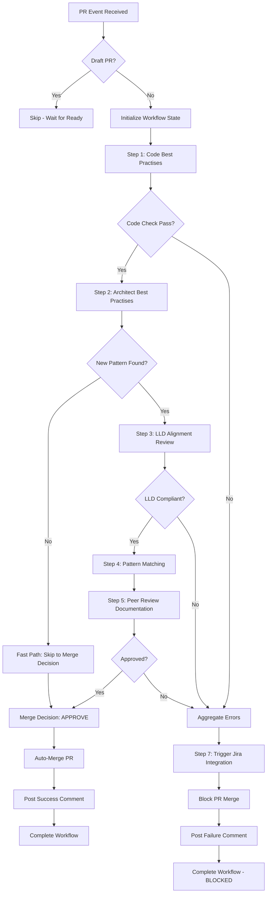

# PR Orchestrator Agent Specification

**Version**: 1.0
**Date**: 2026-01-28
**Status**: Draft
**Project**: Tonic Configuration Management Platform

---

## 1. What is the agent's identity and purpose?

### Agent Identity

| Attribute | Value |
|-----------|-------|
| **Name** | PR Orchestrator Agent |
| **Version** | 1.0 |
| **Role** | Workflow Coordinator |
| **Step** | Step 0 (Orchestration Layer) |

### Purpose

The PR Orchestrator Agent is the **central coordinator** for the peer review workflow. It:

1. **Receives** GitHub PR webhook events
2. **Orchestrates** the sequential execution of all peer review agents
3. **Manages** workflow state and agent dependencies
4. **Aggregates** results from all agents
5. **Decides** whether to approve (auto-merge) or block the PR
6. **Triggers** Jira ticket creation on failures with auto-assignment to PR author

### Problem Statement

**Without orchestration**:
- Agents run independently without coordination
- No centralized decision-making for merge approval
- Failures require manual investigation
- No aggregated view of all check results
- Manual Jira ticket creation on failures

**With orchestration**:
- Single entry point for all PR checks
- Automated merge decision based on all agent results
- Centralized error handling and reporting
- Automatic Jira ticket creation with context
- Complete audit trail

### Business Value

| Metric | Before | After | Improvement |
|--------|--------|-------|-------------|
| Manual coordination time | 30 min/PR | 0 min | 100% elimination |
| Merge decision time | 10 min | 5 sec | 99% reduction |
| Issue tracking accuracy | 70% | 100% | 43% improvement |
| Developer context switches | 5 per PR | 1 per PR | 80% reduction |

---

## 2. What are its core capabilities?

### 2.1 Workflow Orchestration

**Sequential Agent Invocation**:
```
Step 1: Code Best Practises Agent (30 sec SLA)
    ↓ [If PASS]
Step 2: Architect Best Practises Agent (10 sec SLA)
    ↓ [If NEW_PATTERN_FOUND]
Step 3: LLD Alignment Review Agent (20 sec SLA)
    ↓ [If LLD_COMPLIANT]
Step 4: Pattern Matching Agent (2 sec SLA)
    ↓
Step 5: Peer Review Documentation Agent (4 hour SLA)
    ↓ [If APPROVED]
Step 6: GitHub Actions Deployment Hooks
    ↓ [On any FAILURE]
Step 7: Jira Integration Agent (10 sec SLA)
```

**Conditional Branching**:
- Skip Steps 3-5 if no new patterns detected (fast path)
- Trigger Step 7 (Jira) on any failure at any step
- Auto-merge only when all required steps pass

### 2.2 State Management

**Workflow State Machine**:
```
PENDING → IN_PROGRESS → [COMPLETED | FAILED | BLOCKED]
```

**State Persistence**:
- Store workflow state in DynamoDB
- Enable resume after failures
- Maintain execution history for audit

### 2.3 Merge Decision Logic

**Merge Approval Criteria**:
```javascript
function canMerge(workflowResult) {
  return (
    workflowResult.codeQuality.status === 'PASS' &&
    (
      workflowResult.architect.status === 'NO_NEW_PATTERN' ||
      (
        workflowResult.lldAlignment.status === 'LLD_COMPLIANT' &&
        workflowResult.peerReview.status === 'APPROVED'
      )
    )
  );
}
```

### 2.4 Error Aggregation

**Aggregated Error Report**:
- Collect all errors from all agents
- Categorize by severity (CRITICAL, MAJOR, MINOR)
- Generate comprehensive PR comment
- Include remediation guidance

### 2.5 SLA Monitoring

**SLA Thresholds**:

| Path | Target SLA | Escalation Trigger |
|------|------------|-------------------|
| Fast Path (no new patterns) | 1 minute | > 2 minutes |
| Full Path (new patterns) | 4.5 hours | > 4 hours (warning), > 5 hours (escalation) |

---

## 3. What inputs does it accept?

### 3.1 GitHub PR Webhook Event

```json
{
  "event": "pull_request",
  "action": "opened | synchronize | reopened | ready_for_review",
  "pull_request": {
    "number": 123,
    "title": "Feature: Add new payment method",
    "html_url": "https://github.com/org/repo/pull/123",
    "head": {
      "ref": "feature/payment-method",
      "sha": "abc123def456"
    },
    "base": {
      "ref": "main"
    },
    "user": {
      "login": "developer123",
      "email": "developer@company.com"
    },
    "draft": false,
    "mergeable": true,
    "changed_files": 5
  },
  "repository": {
    "full_name": "org/repo",
    "default_branch": "main"
  },
  "sender": {
    "login": "developer123"
  }
}
```

### 3.2 Agent Execution Results

```json
{
  "agent_name": "code_best_practises_agent",
  "execution_id": "exec-123-456",
  "status": "PASS | FAIL",
  "execution_time_ms": 2500,
  "findings": [...],
  "metadata": {
    "patterns_checked": 150,
    "files_analyzed": 5
  }
}
```

### 3.3 Configuration

```json
{
  "workflow_config": {
    "fast_path_enabled": true,
    "auto_merge_enabled": true,
    "require_approval_count": 1,
    "sla_monitoring_enabled": true,
    "jira_integration_enabled": true
  },
  "agent_config": {
    "code_best_practises": { "enabled": true, "timeout_ms": 30000 },
    "architect_best_practises": { "enabled": true, "timeout_ms": 10000 },
    "lld_alignment_review": { "enabled": true, "timeout_ms": 20000 },
    "pattern_matching": { "enabled": true, "timeout_ms": 5000 },
    "peer_review_documentation": { "enabled": true, "timeout_ms": 14400000 },
    "jira_integration": { "enabled": true, "timeout_ms": 10000 }
  }
}
```

---

## 4. What outputs does it produce?

### 4.1 Workflow Status Report

```json
{
  "workflow_id": "wf-2026-01-28-pr-123-abc123",
  "pr_number": 123,
  "repository": "org/repo",
  "status": "COMPLETED | FAILED | BLOCKED | IN_PROGRESS",
  "result": "APPROVED | BLOCKED | WAITING_REVIEW",
  "path_taken": "FAST_PATH | FULL_PATH",
  "started_at": "2026-01-28T10:00:00Z",
  "completed_at": "2026-01-28T10:00:45Z",
  "total_duration_ms": 45000,
  "steps": [
    {
      "step": 1,
      "agent": "code_best_practises_agent",
      "status": "PASS",
      "duration_ms": 25000,
      "sla_met": true
    },
    {
      "step": 2,
      "agent": "architect_best_practises_agent",
      "status": "NO_NEW_PATTERN",
      "duration_ms": 8000,
      "sla_met": true
    }
  ],
  "merge_decision": {
    "can_merge": true,
    "reason": "All checks passed, no new patterns detected",
    "auto_merged": true,
    "merged_at": "2026-01-28T10:00:46Z"
  }
}
```

### 4.2 GitHub PR Comment

```markdown
## 🤖 PR Orchestrator - Review Complete

### Summary
| Check | Status | Duration |
|-------|--------|----------|
| Code Quality | ✅ PASS | 25s |
| Architecture | ✅ NO NEW PATTERN | 8s |
| LLD Alignment | ⏭️ SKIPPED | - |
| Pattern Matching | ⏭️ SKIPPED | - |
| Peer Review | ⏭️ SKIPPED | - |

### Result: ✅ APPROVED

**Total Duration**: 33 seconds (Fast Path)

This PR has been automatically merged.

---
*Generated by PR Orchestrator Agent v1.0*
```

### 4.3 Jira Ticket Trigger (On Failure)

```json
{
  "action": "CREATE_TICKET",
  "issue_type": "CODE_VIOLATION | LLD_DEVIATION | PATTERN_REJECTION",
  "pr_number": 123,
  "pr_url": "https://github.com/org/repo/pull/123",
  "pr_author": "developer123",
  "pr_author_email": "developer@company.com",
  "repository": "org/repo",
  "severity": "HIGH",
  "source_agent": "code_best_practises_agent",
  "workflow_run_url": "https://github.com/org/repo/actions/runs/12345",
  "findings": [
    {
      "file": "src/payment/processor.java",
      "line": 45,
      "type": "NAMING_CONVENTION",
      "message": "Method name 'processPayment' should follow pattern 'process{Entity}Payment'",
      "suggested_fix": "Rename to 'processOrderPayment'"
    }
  ],
  "aggregated_summary": "1 code violation detected in Step 1"
}
```

---

## 5. What constraints does it operate under?

### 5.1 Execution Constraints

| Constraint | Value | Rationale |
|------------|-------|-----------|
| Max concurrent workflows | 100 per repository | Prevent resource exhaustion |
| Workflow timeout | 5 hours | Include buffer for 4-hour review SLA |
| Agent retry attempts | 3 | Balance reliability vs. latency |
| State persistence | Required | Enable crash recovery |

### 5.2 Ordering Constraints

**Strict Sequential Order**:
1. Code Best Practises MUST complete before Architect Best Practises
2. Architect Best Practises MUST complete before LLD Alignment (if new pattern)
3. LLD Alignment MUST complete before Pattern Matching (if compliant)
4. Pattern Matching MUST complete before Peer Review Documentation
5. Jira Integration runs ONLY on failures (any step)

### 5.3 Decision Constraints

| Scenario | Decision | Rationale |
|----------|----------|-----------|
| Any agent times out | BLOCK PR | Incomplete analysis is unsafe |
| Code Best Practises FAIL | BLOCK PR + Jira | Non-negotiable quality gate |
| LLD Deviation | BLOCK PR + Jira | Design compliance required |
| Peer Review REJECTED | BLOCK PR + Jira | Human override respected |
| All checks PASS | AUTO-MERGE | Confidence in automated analysis |

### 5.4 Integration Constraints

- **GitHub API**: Rate limited to 5000 requests/hour
- **Confluence API**: Rate limited to 100 requests/minute
- **Jira API**: Rate limited to 100 requests/minute
- **CloudWatch**: Non-blocking logging (fire and forget)

---

## 6. What are its behavior patterns?

### 6.1 Workflow Execution Pattern



### 6.2 Error Propagation Pattern

**Fail Fast Strategy**:
- First failure stops further agent execution
- Aggregate error immediately
- Trigger Jira ticket creation
- Block PR with detailed report

**Error Classification**:
```javascript
const errorClassification = {
  'TIMEOUT': { severity: 'HIGH', retry: true, jira: true },
  'CODE_VIOLATION': { severity: 'HIGH', retry: false, jira: true },
  'LLD_DEVIATION': { severity: 'HIGH', retry: false, jira: true },
  'PATTERN_REJECTION': { severity: 'MEDIUM', retry: false, jira: true },
  'API_ERROR': { severity: 'HIGH', retry: true, jira: false },
  'INTERNAL_ERROR': { severity: 'CRITICAL', retry: true, jira: true }
};
```

### 6.3 State Transition Pattern

```
PENDING
  ├─[PR Event]─→ IN_PROGRESS

IN_PROGRESS
  ├─[All Pass]─→ COMPLETED (merged)
  ├─[Any Fail]─→ BLOCKED (jira created)
  ├─[Waiting Review]─→ WAITING_REVIEW
  └─[Error]─→ FAILED (retry or escalate)

WAITING_REVIEW
  ├─[Approved]─→ COMPLETED (merged)
  └─[Rejected]─→ BLOCKED (jira created)

BLOCKED
  └─[PR Updated]─→ PENDING (re-run workflow)

FAILED
  ├─[Retry Success]─→ IN_PROGRESS
  └─[Max Retries]─→ BLOCKED (escalate)
```

---

## 7. How does it handle errors?

### 7.1 Retry Strategy

```javascript
const retryConfig = {
  maxRetries: 3,
  initialDelayMs: 1000,
  maxDelayMs: 30000,
  backoffMultiplier: 2,
  jitter: true,
  retryableErrors: [
    'TIMEOUT',
    'API_RATE_LIMITED',
    'NETWORK_ERROR',
    'SERVICE_UNAVAILABLE'
  ]
};
```

### 7.2 Circuit Breaker

```javascript
const circuitBreaker = {
  failureThreshold: 5,
  resetTimeoutMs: 60000,
  halfOpenRequests: 1,
  monitoredAgents: [
    'confluence_api',
    'github_api',
    'jira_api'
  ]
};
```

### 7.3 Fallback Strategies

| Error Scenario | Fallback Action |
|----------------|-----------------|
| Confluence unavailable | Use cached pattern library (30 min TTL) |
| GitHub API rate limited | Queue and retry with backoff |
| Jira unavailable | Queue in SQS for async retry |
| Agent timeout | Retry up to 3 times, then block PR |
| Internal error | Log, alert, block PR with explanation |

### 7.4 Escalation

**Escalation Triggers**:
- Workflow stuck > 5 hours
- Multiple consecutive failures
- Circuit breaker open for > 10 minutes
- Critical infrastructure error

**Escalation Actions**:
1. CloudWatch alarm
2. Slack notification to #platform-alerts
3. PagerDuty alert (critical only)
4. Manual intervention required flag

---

## 8. What are its success criteria?

### 8.1 Functional Success Criteria

| Criterion | Target | Measurement |
|-----------|--------|-------------|
| Workflow completion rate | > 99% | CloudWatch metrics |
| Correct merge decisions | 100% | Manual audit sampling |
| Jira ticket creation on failure | 100% | Audit log comparison |
| Auto-merge on success | 100% | GitHub merge logs |
| SLA compliance (fast path) | > 99% within 1 min | Latency metrics |
| SLA compliance (full path) | > 95% within 4.5 hours | Duration metrics |

### 8.2 Quality Metrics

| Metric | Target | Current Baseline |
|--------|--------|-----------------|
| False positive rate | < 1% | 5% (manual process) |
| False negative rate | < 0.1% | 2% (manual process) |
| Mean time to merge (fast path) | < 1 minute | 30 minutes (manual) |
| Mean time to block (violations) | < 1 minute | 2 hours (manual) |

### 8.3 Reliability Metrics

| Metric | Target |
|--------|--------|
| Availability | 99.9% |
| Error rate | < 0.1% |
| Retry success rate | > 95% |
| Recovery time | < 5 minutes |

---

## 9. What context determines its usage?

### 9.1 Trigger Contexts

| Context | Trigger | Action |
|---------|---------|--------|
| PR opened | `pull_request.opened` | Full workflow |
| PR updated | `pull_request.synchronize` | Full workflow (re-run) |
| PR reopened | `pull_request.reopened` | Full workflow |
| PR ready for review | `pull_request.ready_for_review` | Full workflow |
| PR review submitted | `pull_request_review.submitted` | Resume from Step 5 |

### 9.2 Skip Contexts

| Context | Behavior |
|---------|----------|
| Draft PR | Skip until ready for review |
| Docs-only changes | Skip code analysis (configurable) |
| Skip label present | Skip entire workflow (admin override) |
| Bot PR | Skip (configurable allowlist) |

### 9.3 Branch Protection Integration

```yaml
# Required branch protection settings
branches:
  main:
    protection:
      required_status_checks:
        strict: true
        contexts:
          - "PR Orchestrator Agent"
      required_pull_request_reviews:
        required_approving_review_count: 0  # Handled by orchestrator
      enforce_admins: true
      restrictions: null
```

---

## 10. What are usage examples?

### Example 1: Fast Path - No New Patterns

**Scenario**: Developer submits PR with minor bug fix, no new architectural patterns.

**Timeline**:
```
00:00 - PR opened
00:01 - Workflow initialized
00:02 - Step 1: Code Best Practises started
00:27 - Step 1: PASS (25 sec)
00:28 - Step 2: Architect Best Practises started
00:36 - Step 2: NO_NEW_PATTERN (8 sec)
00:37 - Fast Path: Skip Steps 3-5
00:38 - Merge Decision: APPROVE
00:39 - Auto-merge executed
00:40 - Success comment posted
00:40 - Workflow COMPLETED
```

**Result**: PR merged in 40 seconds.

---

### Example 2: Full Path - New Pattern Approved

**Scenario**: Developer introduces new design pattern, requires architect review.

**Timeline**:
```
00:00 - PR opened
00:01 - Workflow initialized
00:02 - Step 1: Code Best Practises started
00:30 - Step 1: PASS (28 sec)
00:31 - Step 2: Architect Best Practises started
00:40 - Step 2: NEW_PATTERN_FOUND (9 sec)
00:41 - Step 3: LLD Alignment Review started
00:58 - Step 3: LLD_COMPLIANT (17 sec)
00:59 - Step 4: Pattern Matching started
01:02 - Step 4: Pattern stored (3 sec)
01:03 - Step 5: Peer Review Documentation started
01:05 - Reviewer assigned
02:30 - Architect submits review: APPROVED
02:31 - Step 5: APPROVED (1h 28min)
02:32 - Merge Decision: APPROVE
02:33 - Auto-merge executed
02:34 - Success comment posted
02:34 - Workflow COMPLETED
```

**Result**: PR merged in 2 hours 34 minutes (within 4.5 hour SLA).

---

### Example 3: Blocked - Code Violations

**Scenario**: Developer submits PR with naming convention violations.

**Timeline**:
```
00:00 - PR opened
00:01 - Workflow initialized
00:02 - Step 1: Code Best Practises started
00:20 - Step 1: FAIL - 3 violations detected (18 sec)
00:21 - Error aggregated
00:22 - Step 7: Jira Integration triggered
00:28 - Jira ticket SCM-456 created, assigned to developer
00:29 - PR blocked
00:30 - Failure comment posted with violations
00:30 - Workflow BLOCKED
```

**Result**: PR blocked in 30 seconds, Jira ticket created and assigned to PR author.

**Jira Ticket Created**:
```
Project: SCM
Key: SCM-456
Type: Bug
Summary: [PR-123] Code Quality Violations - 3 issues detected
Assignee: developer123
Priority: High
Labels: [peer-review, code-violation, auto-created]
```

---

## Appendix A: Technology Stack

| Component | Technology | Purpose |
|-----------|------------|---------|
| Orchestration | AWS Step Functions | Workflow state machine |
| State Storage | DynamoDB | Workflow state persistence |
| Event Processing | AWS Lambda | Agent invocation |
| Message Queue | AWS SQS | Async operations, retry queue |
| Monitoring | CloudWatch | Metrics, logs, alarms |
| Notifications | SNS + Slack | Escalation alerts |

---

## Appendix B: Open Questions (TBCs)

| ID | Question | Impact | Default |
|----|----------|--------|---------|
| TBC-1 | Should failed PRs be auto-closed? | UX | No - leave open for fixing |
| TBC-2 | Max workflow timeout? | Resource usage | 5 hours |
| TBC-3 | Add Slack notifications for failures? | Developer experience | Yes - to PR author DM |
| TBC-4 | Allow skip label for admin override? | Flexibility | Yes - with audit log |
| TBC-5 | Retry on human review timeout? | SLA compliance | No - escalate instead |

---

**End of Specification**
