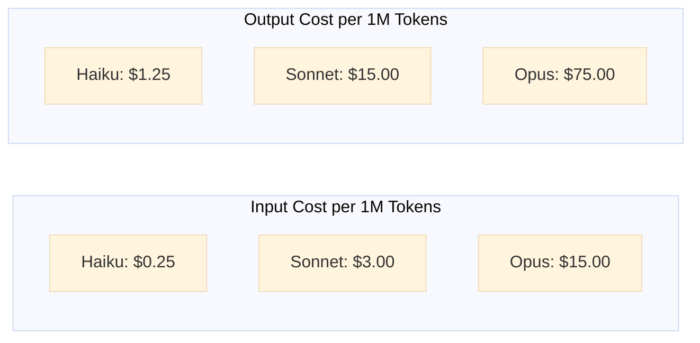

# Diagram 1: Claude Model Cost Comparison

## Purpose
Compare cost per million tokens across Claude models available on AWS Bedrock to inform model selection strategy for PR review agents.

## Mermaid Chart

## Data Table

| Model | Input Cost/1M | Output Cost/1M | Speed | Best For | Source |
|-------|---------------|----------------|-------|----------|--------|
| Claude Haiku | $0.25 | $1.25 | Fastest | High-volume, simple reviews | AWS Bedrock Pricing |
| Claude Sonnet | $3.00 | $15.00 | Fast | Balanced analysis, patterns | AWS Bedrock Pricing |
| Claude Opus | $15.00 | $75.00 | Slower | Complex reasoning | AWS Bedrock Pricing |

## Key Insights
- **12x Cost Difference**: Haiku is 12x cheaper than Sonnet for input, making it ideal for high-volume code quality checks
- **Speed Advantage**: Haiku's faster response time reduces workflow duration
- **Smart Selection**: Using Haiku for 80% of PR reviews and Sonnet for 20% reduces costs by 5-10x vs Sonnet-only
- **Opus Reserved**: Only needed for extremely complex architectural analysis (rare)

## Sources
- AWS Bedrock Pricing: https://aws.amazon.com/bedrock/pricing/ (2026-01)
- Claude Model Documentation: https://docs.anthropic.com/en/docs/about-claude/models

## Stand-Alone Test
✅ Executive immediately sees Haiku's cost advantage for volume operations
