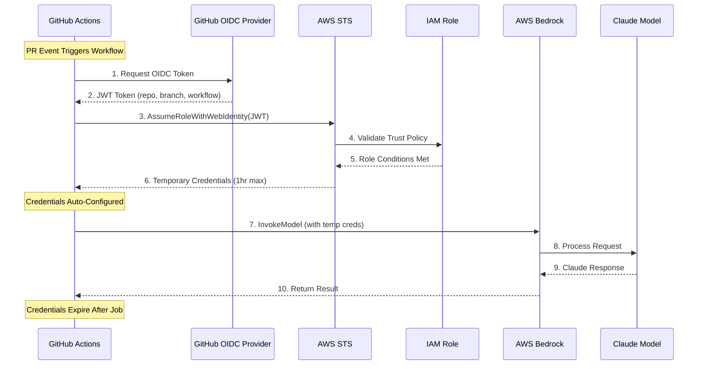

# Diagram 2: OIDC Authentication Flow

## Purpose
Illustrate how GitHub Actions authenticates with AWS Bedrock using OIDC, eliminating the need for stored API keys.

## Mermaid Sequence Diagram

## Data Table

| Step | Component | Action | Security Benefit |
|------|-----------|--------|------------------|
| 1-2 | GitHub OIDC | Generate signed JWT | Token includes repo/branch context |
| 3-5 | AWS STS | Validate and assume role | Trust policy restricts to specific repo |
| 6 | Credentials | Issue temporary creds | Max 1 hour lifetime, auto-rotate |
| 7-10 | Bedrock | Execute Claude request | CloudTrail audit trail |

## Key Insights
- **No Stored Secrets**: Unlike API keys, OIDC tokens are generated per-run
- **Automatic Rotation**: Credentials expire after workflow completes
- **Fine-Grained Access**: Trust policy can restrict by repository, branch, environment
- **Audit Trail**: All AssumeRole and InvokeModel calls logged in CloudTrail
- **Zero Management**: No secret rotation procedures needed

## Comparison: OIDC vs API Key

| Aspect | OIDC | API Key |
|--------|------|---------|
| Secret Storage | None | GitHub Secret |
| Credential Lifetime | 1 hour max | Until rotated |
| Rotation | Automatic | Manual |
| Audit | CloudTrail | Limited |
| Compromise Blast Radius | Single workflow run | Until detected |

## Sources
- AWS OIDC with GitHub: https://aws.amazon.com/blogs/security/use-iam-roles-to-connect-github-actions-to-actions-in-aws/
- GitHub OIDC Documentation: https://docs.github.com/en/actions/deployment/security-hardening-your-deployments/about-security-hardening-with-openid-connect

## Stand-Alone Test
✅ Security team sees credential flow with no long-lived secrets
