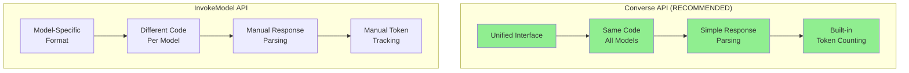

# Diagram 3: Bedrock API Comparison - Converse vs InvokeModel

## Purpose
Compare the two Bedrock APIs for invoking Claude models, recommending the Converse API for its unified interface.

## Mermaid Comparison



## Data Table

| Feature | Converse API | InvokeModel API |
|---------|--------------|-----------------|
| **Interface** | Unified across models | Model-specific |
| **Code Changes for Model Switch** | None | May need updates |
| **Response Format** | Consistent | Varies by model |
| **Token Usage** | Built-in `response['usage']` | Manual calculation |
| **Streaming** | `converse_stream()` | `invoke_model_with_response_stream()` |
| **Learning Curve** | Lower | Higher |
| **Documentation** | Comprehensive | Model-specific |
| **Recommendation** | ✅ **Use This** | For advanced/legacy |

## Code Comparison

### Converse API (Simpler)
```python
response = client.converse(
    modelId="anthropic.claude-3-haiku-20240307-v1:0",
    messages=[{"role": "user", "content": [{"text": prompt}]}],
    inferenceConfig={"maxTokens": 4096, "temperature": 0.2}
)
result = response['output']['message']['content'][0]['text']
tokens = response['usage']['inputTokens']
```

### InvokeModel API (More Verbose)
```python
native_request = {
    "anthropic_version": "bedrock-2023-05-31",
    "max_tokens": 4096,
    "temperature": 0.2,
    "messages": [{"role": "user", "content": [{"type": "text", "text": prompt}]}]
}
response = client.invoke_model(modelId=model_id, body=json.dumps(native_request))
body = json.loads(response['body'].read())
result = body['content'][0]['text']
# Token counting requires separate calculation
```

## Key Insights
- **Write Once**: Converse API code works across Haiku, Sonnet, Opus without changes
- **Cleaner Code**: 40% fewer lines for same functionality
- **Built-in Metrics**: Token usage automatically included in response
- **Future-Proof**: New models automatically supported by Converse API
- **Same Cost**: Both APIs have identical pricing

## Sources
- Boto3 Converse: https://boto3.amazonaws.com/v1/documentation/api/latest/reference/services/bedrock-runtime/client/converse.html
- Bedrock InvokeModel: https://docs.aws.amazon.com/bedrock/latest/userguide/model-parameters-claude.html

## Stand-Alone Test
✅ Developer sees Converse API as simpler, unified approach
