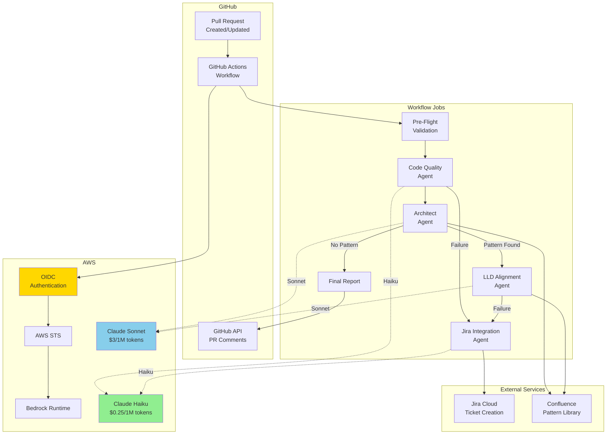

# Diagram 4: Complete PR Review System Architecture

## Purpose
Show the end-to-end architecture of the PR Peer Review system using AWS Bedrock Claude models.

## Mermaid Architecture Diagram

## Data Table - Component Details

| Component | Technology | Purpose | Model Used |
|-----------|------------|---------|------------|
| Pre-Flight | GitHub Actions | Validate PR, detect changes | N/A |
| Code Quality Agent | Python + Bedrock | Check coding standards | **Haiku** |
| Architect Agent | Python + Bedrock | Detect new patterns | **Sonnet** |
| LLD Alignment Agent | Python + Bedrock | Validate against LLD | **Sonnet** |
| Jira Integration | Python + Bedrock | Create tickets on failure | **Haiku** |
| Final Report | GitHub Actions | Aggregate, post comment | N/A |

## Data Flow

| Step | From | To | Data |
|------|------|-----|------|
| 1 | PR Event | Pre-Flight | PR metadata, files changed |
| 2 | Pre-Flight | Code Quality | PR diff, file list |
| 3 | Code Quality | Architect | Violations (if any), pass/fail |
| 4 | Architect | LLD (conditional) | Pattern details |
| 5 | Any Failure | Jira Integration | Failure context, author |
| 6 | All Agents | Final Report | Aggregated results |
| 7 | Final Report | GitHub | PR comment, status check |

## Key Insights
- **Smart Model Selection**: Haiku for volume (Code Quality, Jira), Sonnet for complexity (Architect, LLD)
- **Conditional Execution**: LLD only runs when Architect detects new pattern
- **Single Authentication**: OIDC credentials shared across all Bedrock calls
- **Fail Fast**: Code Quality failures skip Architect/LLD stages
- **External Integration**: Confluence for patterns, Jira for tickets

## Cost Flow (Per PR Review)

| Scenario | Code Quality | Architect | LLD | Jira | Total |
|----------|--------------|-----------|-----|------|-------|
| Pass (no pattern) | $0.003 | $0.02 | - | - | **$0.023** |
| Pass (with pattern) | $0.003 | $0.02 | $0.04 | - | **$0.063** |
| Fail (violations) | $0.003 | - | - | $0.002 | **$0.005** |

## Sources
- AWS Bedrock Architecture: https://docs.aws.amazon.com/bedrock/latest/userguide/what-is-bedrock.html
- GitHub Actions: https://docs.github.com/en/actions

## Stand-Alone Test
✅ Architect sees complete system flow, model selection per agent, external integrations
