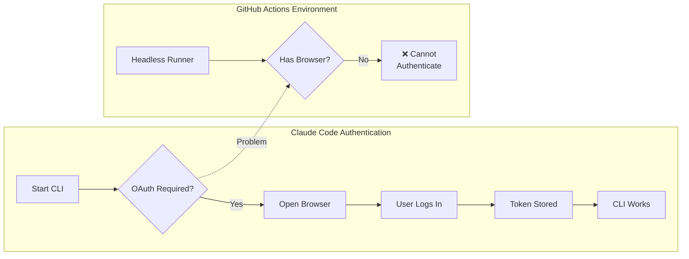
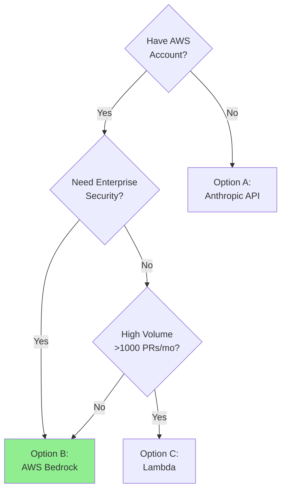

# Diagram 5: LLM Integration Options Comparison

## Purpose
Compare the four options for running Claude in GitHub Actions, explaining why Option B (AWS Bedrock) is recommended.

## Mermaid Comparison Matrix

```mermaid
flowchart TB
    subgraph "Option A: Direct Anthropic API"
        A1[curl/Python] --> A2[API Key in Secrets]
        A2 --> A3[❌ Key Management<br/>Required]
        style A3 fill:#FFCCCC
    end

    subgraph "Option B: AWS Bedrock (RECOMMENDED)"
        B1[Python boto3] --> B2[OIDC Auth]
        B2 --> B3[✅ No Secrets<br/>Enterprise Ready]
        style B3 fill:#90EE90
    end

    subgraph "Option C: AWS Lambda"
        C1[Lambda Function] --> C2[More Complex]
        C2 --> C3[⚠️ Overkill for<br/>Most Teams]
        style C3 fill:#FFFFCC
    end

    subgraph "Option D: Claude Code CLI"
        D1[Self-Hosted Runner] --> D2[Browser OAuth]
        D2 --> D3[❌ NOT VIABLE<br/>Requires Interactive Auth]
        style D3 fill:#FF6666
    end
```

## Data Table - Option Comparison

| Criteria | Option A Anthropic API | Option B AWS Bedrock | Option C Lambda | Option D Claude Code |
|----------|---------------------------|-------------------------|---------------------|-------------------------|
| **Viability** | ✅ Yes | ✅ **Yes** | ✅ Yes | ❌ **No** |
| **Authentication** | API Key | OIDC (No secrets) | IAM Role | Browser OAuth |
| **Setup Complexity** | Low | Medium | High | N/A |
| **Secret Management** | Required | **Not needed** | Not needed | N/A |
| **Cost Tracking** | Separate billing | AWS consolidated | AWS consolidated | N/A |
| **Scaling** | Manual | Auto | Auto | N/A |
| **Enterprise Ready** | ⚠️ Limited | ✅ **Yes** | ✅ Yes | ❌ No |
| **Recommendation** | Acceptable | ✅ **Best** | For high volume | ❌ Avoid |

## Why Option D (Claude Code) Doesn't Work

**Key Blockers for Claude Code in CI**:
1. OAuth requires browser interaction
2. GitHub Actions runners are headless
3. No supported non-interactive authentication mode
4. Session tokens cannot be pre-generated

## Why Option B (Bedrock) is Recommended

| Benefit | Explanation |
|---------|-------------|
| **No Secret Storage** | OIDC generates short-lived credentials per workflow run |
| **Enterprise Security** | Uses existing AWS IAM, integrates with SSO/SAML |
| **Cost Transparency** | All charges appear in AWS bill, easy to track |
| **Model Flexibility** | Switch Haiku/Sonnet/Opus without code changes |
| **Existing Infrastructure** | Leverages AWS services already in use |
| **Compliance** | Data stays in AWS, meets data residency requirements |
| **Audit Trail** | CloudTrail logs all API calls |

## Decision Tree

## Key Insights
- **Option D Eliminated**: Claude Code CLI fundamentally incompatible with CI/CD
- **Option B Recommended**: Best balance of security, simplicity, and enterprise features
- **Option A Acceptable**: For teams without AWS, but requires API key management
- **Option C Reserved**: For very high-volume scenarios (>1000 PRs/month)

## Sources
- Claude Code Authentication: https://docs.anthropic.com/en/docs/claude-code
- AWS Bedrock Security: https://docs.aws.amazon.com/bedrock/latest/userguide/security.html
- Anthropic API: https://docs.anthropic.com/en/api/getting-started

## Stand-Alone Test
✅ Decision maker sees Option B as clear winner, understands why Claude Code won't work
