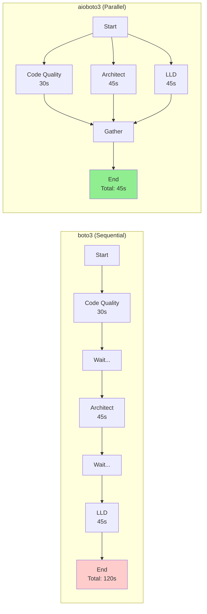
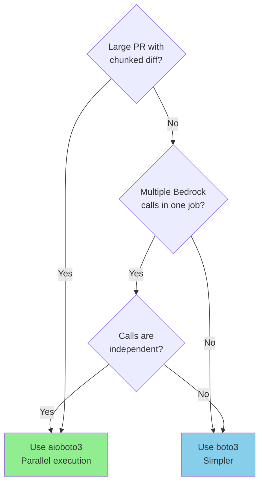

# Diagram 6: aioboto3 vs boto3 Performance Comparison

## Purpose
Compare synchronous boto3 with asynchronous aioboto3 for AWS Bedrock operations, showing performance benefits of parallel execution.

## Mermaid Timeline Comparison

```mermaid
gantt
    title PR Review Pipeline Execution Time
    dateFormat X
    axisFormat %s

    section boto3 (Sequential)
    Code Quality Agent    :a1, 0, 30s
    Architect Agent       :a2, after a1, 45s
    LLD Alignment Agent   :a3, after a2, 45s
    Total: 120s          :milestone, 120, 0

    section aioboto3 (Parallel)
    Code Quality Agent    :b1, 0, 30s
    Architect Agent       :b2, 0, 45s
    LLD Alignment Agent   :b3, 0, 45s
    Total: 45s           :milestone, 45, 0
```



## Data Table - Execution Time Comparison

| Scenario | boto3 (Sync) | aioboto3 (Async) | Speedup |
|----------|--------------|------------------|---------|
| 3 agents sequential | 120s | 45s | **2.7x** |
| 4 chunk processing | 120s | 35s | **3.4x** |
| Ensemble (2 models) | 75s | 45s | **1.7x** |
| Single agent call | 30s | 30s | 1x |

## Architecture Comparison



## Benchmark Results

**Source**: [Joel McCoy - boto3 Performance Adventures](https://joelmccoy.medium.com/python-and-boto3-performance-adventures-synchronous-vs-asynchronous-aws-api-interaction-22f625ec6909)

| Approach | Elapsed Time | vs Sync |
|----------|--------------|---------|
| Synchronous boto3 | 7.62s | baseline |
| Async boto3 (ThreadPool) | 0.83s | 9.2x faster |
| Async aioboto3 | 1.43s | **5.3x faster** |

## Key Insights

- **Parallel Wins**: For multiple independent Bedrock calls, aioboto3 provides significant speedup
- **Clean Async**: Native asyncio without thread management complexity
- **Same API**: aioboto3 mirrors boto3 API, just add `await`
- **Chunk Processing**: Large PRs benefit most from parallel chunk analysis
- **Single Calls**: No benefit for single-call scenarios (workflow-level parallelism sufficient)

## When to Use Each



## Code Comparison

### boto3 (Sequential)
```python
# Takes 120 seconds
result1 = client.converse(modelId=model1, ...)  # 30s
result2 = client.converse(modelId=model2, ...)  # 45s
result3 = client.converse(modelId=model3, ...)  # 45s
```

### aioboto3 (Parallel)
```python
# Takes 45 seconds (max of all)
results = await asyncio.gather(
    client.converse(modelId=model1, ...),  # 30s
    client.converse(modelId=model2, ...),  # 45s
    client.converse(modelId=model3, ...),  # 45s
)
```

## Sources

- [aioboto3 PyPI](https://pypi.org/project/aioboto3/)
- [GitHub Issue #341 - Converse API Support](https://github.com/terricain/aioboto3/issues/341)
- [Joel McCoy - Performance Benchmarks](https://joelmccoy.medium.com/python-and-boto3-performance-adventures-synchronous-vs-asynchronous-aws-api-interaction-22f625ec6909)

## Stand-Alone Test
✅ Decision maker sees 2.7x speedup potential with aioboto3 for parallel agent execution
