# Architecture Diagrams: GitHub → Lambda → Bedrock Integration

## Overview

This document contains detailed architecture diagrams showing how GitHub Actions, AWS Lambda, and AWS Bedrock work together to power the PR Peer Review Agent system.

---

## 1. Master Architecture Diagram

### Complete System Flow


---

## 2. Authentication Deep Dive

### OIDC Federation Flow


### IAM Policy Structure


---

## 3. Lambda Execution Architecture

### Internal Lambda Structure

```mermaid
flowchart TB
    subgraph "Lambda Function: pr-review-orchestrator"
        HANDLER[🚀 handler.lambda_handler<br/>Entry Point]

        subgraph "Core Services"
            PR_SVC[PR Context Service<br/>Fetch PR data from GitHub]
            BEDROCK_SVC[Bedrock Service<br/>aioboto3 async client]
            JIRA_SVC[Jira Service<br/>Ticket creation]
        end

        subgraph "Agents"
            CQ[Code Quality Agent<br/>Prompt: code_best_practices.md]
            ARCH[Architect Agent<br/>Prompt: architect_best_practices.md]
            LLD[LLD Alignment Agent<br/>Prompt: lld_alignment.md]
            JIRA_A[Jira Integration Agent<br/>Prompt: jira_integration.md]
        end

        subgraph "Utilities"
            CHUNKER[Diff Chunker<br/>Split large diffs]
            PARSER[Response Parser<br/>JSON extraction]
            AGGREGATOR[Result Aggregator<br/>Combine parallel results]
            REPORTER[Report Generator<br/>Format PR comment]
        end
    end

    subgraph "External"
        GH_API[GitHub API]
        BEDROCK[AWS Bedrock]
        JIRA_API[Jira API]
    end

    HANDLER --> PR_SVC
    PR_SVC --> GH_API

    HANDLER --> BEDROCK_SVC

    BEDROCK_SVC --> CQ
    BEDROCK_SVC --> ARCH
    BEDROCK_SVC --> LLD
    BEDROCK_SVC --> JIRA_A

    CQ --> BEDROCK
    ARCH --> BEDROCK
    LLD --> BEDROCK
    JIRA_A --> BEDROCK

    PR_SVC --> CHUNKER
    CHUNKER --> BEDROCK_SVC

    BEDROCK --> PARSER
    PARSER --> AGGREGATOR
    AGGREGATOR --> REPORTER

    JIRA_A --> JIRA_SVC --> JIRA_API

    style HANDLER fill:#FF9900
    style BEDROCK_SVC fill:#FF9900
```



### Async Execution Timeline

```mermaid
gantt
    title Lambda Agent Execution Timeline
    dateFormat ss
    axisFormat %S s

    section Initialization
    Cold Start (if applicable)    :init, 00, 2s
    Load PR Context               :context, after init, 1s

    section Sequential Approach (boto3)
    Code Quality Agent            :seq_cq, after context, 30s
    Wait for CQ result            :milestone, m1, after seq_cq, 0s
    Architect Agent               :seq_arch, after seq_cq, 45s
    Wait for Arch result          :milestone, m2, after seq_arch, 0s
    LLD Alignment Agent           :seq_lld, after seq_arch, 45s
    Total Sequential: ~123s       :milestone, m3, after seq_lld, 0s

    section Parallel Approach (aioboto3)
    Code Quality Agent            :par_cq, after context, 30s
    Architect Agent               :par_arch, after context, 45s
    LLD Alignment Agent           :par_lld, after context, 45s
    asyncio.gather() completion   :milestone, m4, 48, 0s
    Total Parallel: ~48s          :crit, result, 48, 1s
```

---

## 4. Agent Decision Flow

### Review Pipeline Logic

```mermaid
flowchart TD
    START([🚀 PR Review Triggered]) --> PREFLIGHT{Pre-Flight<br/>Checks}

    PREFLIGHT -->|Draft PR| SKIP([⏭️ Skip Review])
    PREFLIGHT -->|No Code Changes| SKIP
    PREFLIGHT -->|skip-review label| SKIP
    PREFLIGHT -->|✅ Proceed| CQ

    CQ[🔍 Code Quality Agent<br/>Claude Haiku]

    CQ --> CQ_RESULT{Code Quality<br/>Result}

    CQ_RESULT -->|PASS<br/>No Violations| ARCH
    CQ_RESULT -->|FAIL<br/>Violations Found| JIRA_CQ

    ARCH[🏗️ Architect Agent<br/>Claude Sonnet]

    ARCH --> ARCH_RESULT{New Pattern<br/>Detected?}

    ARCH_RESULT -->|NO_NEW_PATTERN| APPROVE
    ARCH_RESULT -->|NEW_PATTERN_DETECTED| LLD

    LLD[📐 LLD Alignment Agent<br/>Claude Sonnet]

    LLD --> LLD_RESULT{LLD Alignment<br/>Check}

    LLD_RESULT -->|LLD_COMPLIANT| PATTERN_REVIEW
    LLD_RESULT -->|LLD_DEVIATION_FOUND| JIRA_LLD

    JIRA_CQ[🎫 Create Jira Ticket<br/>Type: Code Violations]
    JIRA_LLD[🎫 Create Jira Ticket<br/>Type: LLD Deviation]

    JIRA_CQ --> BLOCK
    JIRA_LLD --> BLOCK

    APPROVE([✅ APPROVED<br/>Ready to Merge])
    PATTERN_REVIEW([⏳ WAITING_REVIEW<br/>New Pattern Approval])
    BLOCK([❌ BLOCKED<br/>Fix Required])

    APPROVE --> REPORT
    PATTERN_REVIEW --> REPORT
    BLOCK --> REPORT

    REPORT[📊 Generate Report<br/>Post to GitHub]

    REPORT --> COMMENT[💬 PR Comment]
    REPORT --> STATUS[✅ Status Check]

    style CQ fill:#90EE90
    style ARCH fill:#87CEEB
    style LLD fill:#87CEEB
    style APPROVE fill:#90EE90
    style BLOCK fill:#FF6B6B
    style PATTERN_REVIEW fill:#FFD700
```



---

## 5. Bedrock API Interaction

### Converse API Flow


### Request/Response Structure

```mermaid
flowchart LR
    subgraph "Request"
        REQ[converse() Call]
        MODEL[modelId:<br/>anthropic.claude-3-haiku...]
        MSG[messages:<br/>role: user<br/>content: text]
        CONFIG[inferenceConfig:<br/>maxTokens: 4096<br/>temperature: 0.2<br/>topP: 0.9]
    end

    subgraph "Response"
        RESP[ConversationResponse]
        OUTPUT[output.message.content[0].text:<br/>JSON review result]
        USAGE[usage:<br/>inputTokens: 5000<br/>outputTokens: 800]
        STOP[stopReason:<br/>end_turn]
    end

    REQ --> MODEL
    REQ --> MSG
    REQ --> CONFIG

    REQ ==>|API Call| RESP

    RESP --> OUTPUT
    RESP --> USAGE
    RESP --> STOP

    style REQ fill:#87CEEB
    style RESP fill:#90EE90
```

---

## 6. Error Handling Architecture

### Retry & Circuit Breaker Pattern


### Error Classification


---

## 7. Monitoring Dashboard

### CloudWatch Metrics Layout

```mermaid
flowchart TB
    subgraph "CloudWatch Dashboard: PR Review System"
        subgraph "Row 1: Lambda Health"
            M1[📊 Invocations<br/>Count per minute]
            M2[⏱️ Duration<br/>p50, p95, p99]
            M3[❌ Errors<br/>Error rate %]
            M4[🚫 Throttles<br/>Concurrent limit hits]
        end

        subgraph "Row 2: Bedrock Usage"
            M5[📈 Bedrock Latency<br/>Response time]
            M6[📥 Input Tokens<br/>Sum per hour]
            M7[📤 Output Tokens<br/>Sum per hour]
            M8[💰 Estimated Cost<br/>USD per day]
        end

        subgraph "Row 3: Business Metrics"
            M9[✅ Reviews Completed<br/>PRs per day]
            M10[📊 Pass Rate<br/>% approved]
            M11[🎫 Jira Tickets<br/>Created per week]
            M12[⏱️ Avg Review Time<br/>Seconds]
        end

        subgraph "Row 4: Alerts"
            A1[🔴 High Error Rate<br/>> 5% in 5 min]
            A2[🟡 Latency Spike<br/>> 60s p95]
            A3[🟠 Cost Anomaly<br/>> 150% daily avg]
        end
    end

    M3 -.->|Triggers| A1
    M2 -.->|Triggers| A2
    M8 -.->|Triggers| A3
```



---

## 8. Deployment Pipeline

### Infrastructure Deployment

```mermaid
flowchart LR
    subgraph "Source"
        CODE[Lambda Code]
        IaC[Terraform/CDK]
    end

    subgraph "CI Pipeline"
        LINT[Lint & Format]
        TEST[Unit Tests]
        SEC[Security Scan]
    end

    subgraph "Build"
        PKG[Package Lambda]
        LAYER[Build Layers]
        ARTIFACT[Upload to S3]
    end

    subgraph "Deploy"
        PLAN[Terraform Plan]
        REVIEW[Manual Review]
        APPLY[Terraform Apply]
    end

    subgraph "Environments"
        DEV[🔧 Dev]
        STAGING[🧪 Staging]
        PROD[🚀 Production]
    end

    CODE --> LINT
    IaC --> LINT
    LINT --> TEST
    TEST --> SEC
    SEC --> PKG
    SEC --> LAYER
    PKG --> ARTIFACT
    LAYER --> ARTIFACT

    ARTIFACT --> PLAN
    PLAN --> REVIEW
    REVIEW --> APPLY

    APPLY --> DEV
    DEV -->|Promote| STAGING
    STAGING -->|Promote| PROD

    style PROD fill:#90EE90
```



---

## 9. Cost Architecture

### Cost Flow Diagram


---

## 10. Quick Reference Card

### System Components at a Glance

| Layer | Component | Technology | Purpose |
|-------|-----------|------------|---------|
| **Trigger** | GitHub Webhook | GitHub Actions | PR event detection |
| **Auth** | OIDC Federation | AWS IAM | Secure authentication |
| **Compute** | Agent Orchestrator | AWS Lambda + Python 3.11 | Agent execution |
| **AI** | Code Quality | Claude Haiku | Fast code review |
| **AI** | Architect | Claude Sonnet | Pattern detection |
| **AI** | LLD Alignment | Claude Sonnet | Design compliance |
| **Integration** | Jira Agent | Jira REST API | Ticket creation |
| **Storage** | Artifacts | S3 | Review data |
| **Monitoring** | Metrics | CloudWatch | Observability |

### Key Configuration Values

| Setting | Value | Notes |
|---------|-------|-------|
| Lambda Memory | 1024 MB | Parallel agent support |
| Lambda Timeout | 300 sec | Large PR processing |
| Bedrock Region | us-east-1 | Best model availability |
| OIDC Token Duration | 1 hour | Auto-refresh |
| Retry Attempts | 3 | With exponential backoff |
| Max Diff Size | 100 KB | Per agent call |

---

**End of Architecture Diagrams**
