# High-Level Design: PR Peer Review System with AWS Bedrock

## Document Information

| Field | Value |
|-------|-------|
| **Document Type** | High-Level Design (HLD) |
| **Version** | 1.0 |
| **Date** | 2026-01-30 |
| **Status** | Draft |
| **Author** | Claude (Agentic Architect Agent) |

---

## 1. Executive Summary

This High-Level Design document describes the architecture of an automated PR Peer Review System that integrates GitHub Actions, AWS Lambda, and AWS Bedrock to execute Claude AI agents for code review automation.

The system provides:
- **Automated code quality analysis** on every pull request
- **Architectural pattern detection** to ensure compliance
- **LLD alignment verification** against design specifications
- **Automated Jira ticket creation** for failed reviews
- **Asynchronous parallel execution** for optimal performance

---

## 2. System Context Diagram

### 2.1 High-Level Context


### 2.2 Simplified Context Flow


---

## 3. System Architecture

### 3.1 Complete Architecture Overview


### 3.2 Deployment Architecture Options


---

## 4. Component Architecture

### 4.1 Agent Orchestration Flow

```mermaid
flowchart TD
    START[🚀 PR Event Received] --> PF{Pre-Flight<br/>Validation}

    PF -->|Skip Review| SKIP[Skip - No Code Changes]
    PF -->|Draft PR| SKIP
    PF -->|Proceed| CQ[Code Quality Agent<br/>Claude Haiku]

    CQ -->|PASS| ARCH[Architect Agent<br/>Claude Sonnet]
    CQ -->|FAIL| JIRA_CQ[Create Jira Ticket<br/>Code Violations]

    ARCH -->|No New Pattern| APPROVE[✅ Approve PR]
    ARCH -->|New Pattern Found| LLD[LLD Alignment Agent<br/>Claude Sonnet]

    LLD -->|Compliant| PATTERN_REQ[Request Pattern Approval]
    LLD -->|Deviation| JIRA_LLD[Create Jira Ticket<br/>LLD Deviation]

    JIRA_CQ --> BLOCK[❌ Block PR]
    JIRA_LLD --> BLOCK

    APPROVE --> REPORT[📊 Final Report]
    PATTERN_REQ --> REPORT
    BLOCK --> REPORT

    REPORT --> COMMENT[Post GitHub Comment]

    style CQ fill:#90EE90
    style ARCH fill:#87CEEB
    style LLD fill:#87CEEB
    style APPROVE fill:#90EE90
    style BLOCK fill:#FF6B6B
```



### 4.2 Lambda Function Architecture


---

## 5. Data Flow Architecture

### 5.1 Request/Response Flow


### 5.2 Data Schema


---

## 6. AWS Infrastructure Architecture

### 6.1 AWS Resource Topology


### 6.2 IAM Permission Model


---

## 7. Lambda Function Specifications

### 7.1 Function Configuration

| Setting | Value | Rationale |
|---------|-------|-----------|
| **Runtime** | Python 3.11 | aioboto3 compatibility |
| **Memory** | 1024 MB | Parallel agent execution |
| **Timeout** | 300 seconds | Large PR processing |
| **Architecture** | arm64 | Cost optimization |
| **Concurrency** | 100 | Rate limiting protection |

### 7.2 Lambda Layers


### 7.3 Environment Variables

| Variable | Description | Example |
|----------|-------------|---------|
| `AWS_REGION` | Bedrock region | `us-east-1` |
| `DEFAULT_MODEL` | Fallback model | `haiku` |
| `CODE_QUALITY_MODEL` | CQ agent model | `haiku` |
| `ARCHITECT_MODEL` | Architect model | `sonnet` |
| `LLD_MODEL` | LLD agent model | `sonnet` |
| `JIRA_BASE_URL` | Jira instance | `https://company.atlassian.net` |
| `CONFLUENCE_BASE_URL` | Confluence instance | `https://company.atlassian.net/wiki` |
| `LOG_LEVEL` | Logging verbosity | `INFO` |

---

## 8. Integration Patterns

### 8.1 GitHub Integration


### 8.2 Jira Integration Pattern


---

## 9. Async Execution Model

### 9.1 aioboto3 Parallel Execution

```mermaid
gantt
    title Agent Execution Timeline Comparison
    dateFormat s
    axisFormat %S

    section Sequential (boto3)
    Code Quality Agent    :a1, 0, 30s
    Architect Agent       :a2, 30, 45s
    LLD Alignment Agent   :a3, 75, 45s
    Total: 120s           :milestone, m1, 120, 0s

    section Parallel (aioboto3)
    Code Quality Agent    :b1, 0, 30s
    Architect Agent       :b2, 0, 45s
    LLD Alignment Agent   :b3, 0, 45s
    Total: 45s            :milestone, m2, 45, 0s
```

### 9.2 Async Code Pattern

```python
async def run_parallel_agents(pr_context: dict) -> dict:
    """Execute multiple agents concurrently using aioboto3."""
    session = aioboto3.Session()

    async def run_agent(agent_name: str, model: str) -> dict:
        async with session.client("bedrock-runtime") as client:
            response = await client.converse(
                modelId=model,
                messages=[{"role": "user", "content": [{"text": prompt}]}],
                inferenceConfig={"maxTokens": 4096, "temperature": 0.2}
            )
            return parse_response(response)

    # Execute all agents in parallel
    results = await asyncio.gather(
        run_agent("code_quality", "anthropic.claude-3-haiku-20240307-v1:0"),
        run_agent("architect", "anthropic.claude-3-5-sonnet-20241022-v2:0"),
        run_agent("lld_alignment", "anthropic.claude-3-5-sonnet-20241022-v2:0"),
        return_exceptions=True
    )

    return aggregate_results(results)
```

---

## 10. Security Architecture

### 10.1 Authentication Flow


### 10.2 Security Controls

| Control | Implementation | Purpose |
|---------|----------------|---------|
| **No Stored Secrets** | OIDC authentication | Eliminate credential exposure |
| **Short-lived Tokens** | 15-60 minute credentials | Reduce attack window |
| **Least Privilege** | Minimal IAM permissions | Limit blast radius |
| **Audit Logging** | CloudTrail enabled | Compliance and forensics |
| **Network Isolation** | VPC endpoints (optional) | Private Bedrock access |
| **Input Validation** | Diff size limits | Prevent prompt injection |

---

## 11. Cost Model

### 11.1 Cost Components


### 11.2 Cost Projections

| Component | Unit Cost | Usage (100 PRs) | Monthly Cost |
|-----------|-----------|-----------------|--------------|
| **Claude Haiku** | $0.25/$1.25 per 1M tokens | 200K in / 50K out | $0.10 |
| **Claude Sonnet** | $3.00/$15.00 per 1M tokens | 300K in / 75K out | $2.00 |
| **Lambda** | $0.20 per 1M requests | 300 invocations | $0.06 |
| **Data Transfer** | $0.09 per GB | 1 GB | $0.09 |
| **CloudWatch** | $0.50 per GB logs | 500 MB | $0.25 |
| **S3** | $0.023 per GB | 100 MB | $0.01 |
| **DynamoDB** | On-demand pricing | 1000 WCU | $0.50 |
| **Total** | - | - | **~$3.00/month** |

---

## 12. Monitoring & Observability

### 12.1 Metrics Dashboard


### 12.2 Log Structure

```json
{
  "timestamp": "2026-01-30T10:00:00Z",
  "workflow_id": "wf-20260130-pr-123-abc1234",
  "pr_number": 123,
  "agent": "code_quality",
  "model": "anthropic.claude-3-haiku-20240307-v1:0",
  "status": "PASS",
  "duration_ms": 2500,
  "input_tokens": 5000,
  "output_tokens": 800,
  "cost_usd": 0.002,
  "violations_count": 0
}
```

---

## 13. Failure Handling

### 13.1 Error Recovery Flow


### 13.2 Circuit Breaker Pattern


---

## 14. Scalability Considerations

### 14.1 Scaling Architecture


### 14.2 Scaling Limits

| Resource | Default Limit | Recommended | Notes |
|----------|---------------|-------------|-------|
| **Lambda Concurrency** | 1000 | 100 | Per-function limit |
| **Bedrock TPM (Haiku)** | 100K | Request increase | Tokens per minute |
| **Bedrock TPM (Sonnet)** | 50K | Request increase | Tokens per minute |
| **SQS Message Size** | 256 KB | N/A | PR context may exceed |
| **GitHub API Rate** | 5000/hr | N/A | Use conditional requests |

---

## 15. Deployment Architecture

### 15.1 CI/CD Pipeline

```mermaid
flowchart LR
    subgraph "Source"
        REPO[GitHub Repo]
    end

    subgraph "Build"
        GHA[GitHub Actions]
        TEST[Unit Tests]
        LINT[Linting]
    end

    subgraph "Package"
        ZIP[Lambda Package]
        LAYER[Lambda Layer]
    end

    subgraph "Deploy"
        TF[Terraform]
        CFN[CloudFormation]
    end

    subgraph "Environments"
        DEV[Dev]
        STAGING[Staging]
        PROD[Production]
    end

    REPO --> GHA
    GHA --> TEST
    GHA --> LINT
    TEST --> ZIP
    LINT --> ZIP
    ZIP --> LAYER
    LAYER --> TF
    TF --> DEV
    DEV --> STAGING
    STAGING --> PROD

    style PROD fill:#90EE90
```

### 15.2 Infrastructure as Code

```hcl
# Terraform Resource Overview
resource "aws_lambda_function" "pr_review_orchestrator" {
  function_name = "pr-review-orchestrator"
  runtime       = "python3.11"
  handler       = "handler.lambda_handler"
  memory_size   = 1024
  timeout       = 300

  environment {
    variables = {
      DEFAULT_MODEL = "haiku"
      AWS_REGION    = "us-east-1"
    }
  }
}

resource "aws_iam_role" "github_pr_review" {
  name               = "github-pr-review-role"
  assume_role_policy = data.aws_iam_policy_document.github_oidc.json
}
```

---

## 16. Appendix

### 16.1 Glossary

| Term | Definition |
|------|------------|
| **OIDC** | OpenID Connect - Federated authentication standard |
| **STS** | Security Token Service - AWS temporary credential service |
| **Bedrock** | AWS managed service for foundation models |
| **Converse API** | Unified Bedrock API for chat-based models |
| **aioboto3** | Async Python SDK for AWS services |
| **LLD** | Low-Level Design - Detailed technical specifications |

### 16.2 References

- [AWS Bedrock Documentation](https://docs.aws.amazon.com/bedrock/)
- [GitHub Actions OIDC](https://docs.github.com/en/actions/deployment/security-hardening-your-deployments/configuring-openid-connect-in-amazon-web-services)
- [Claude on Amazon Bedrock](https://docs.anthropic.com/en/build-with-claude/claude-on-amazon-bedrock)
- [aioboto3 Documentation](https://aioboto3.readthedocs.io/)

---

## 17. Document History

| Version | Date | Author | Changes |
|---------|------|--------|---------|
| 1.0 | 2026-01-30 | Claude | Initial HLD document |

---

**End of High-Level Design Document**
