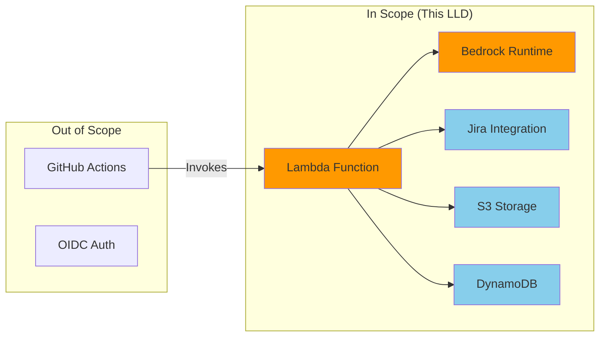
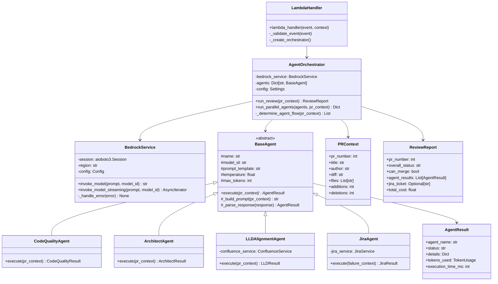
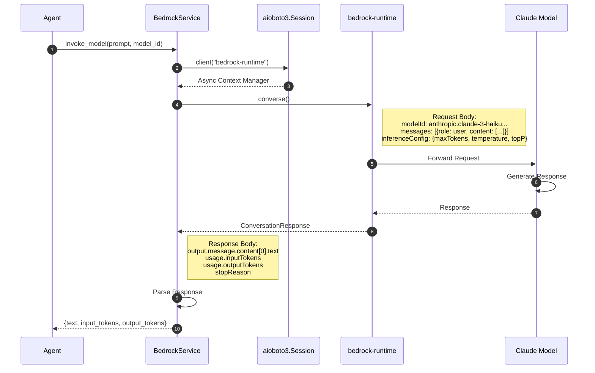
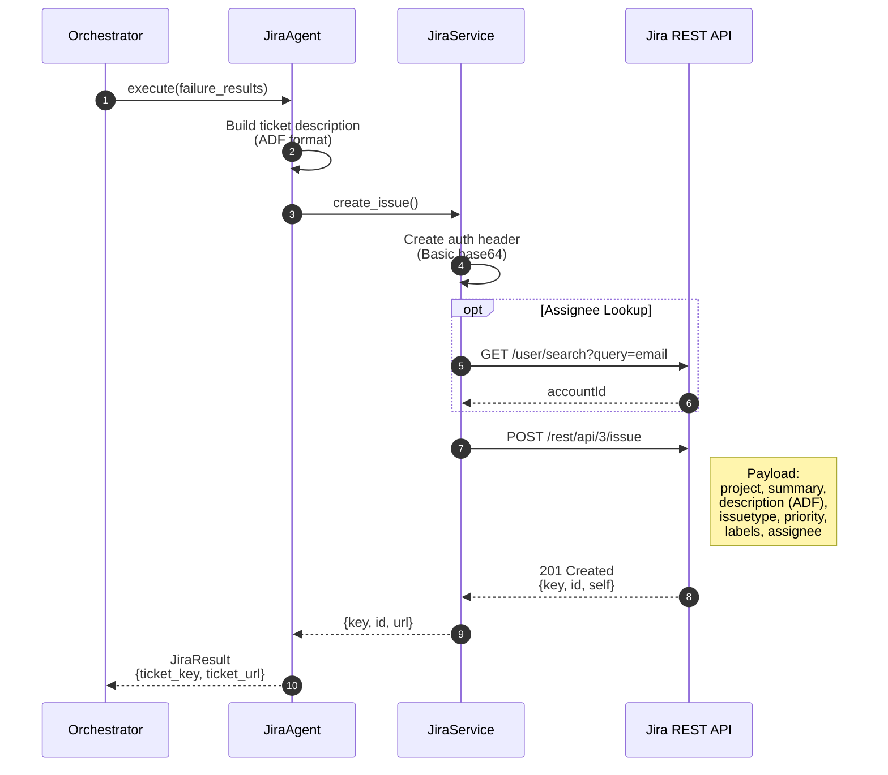
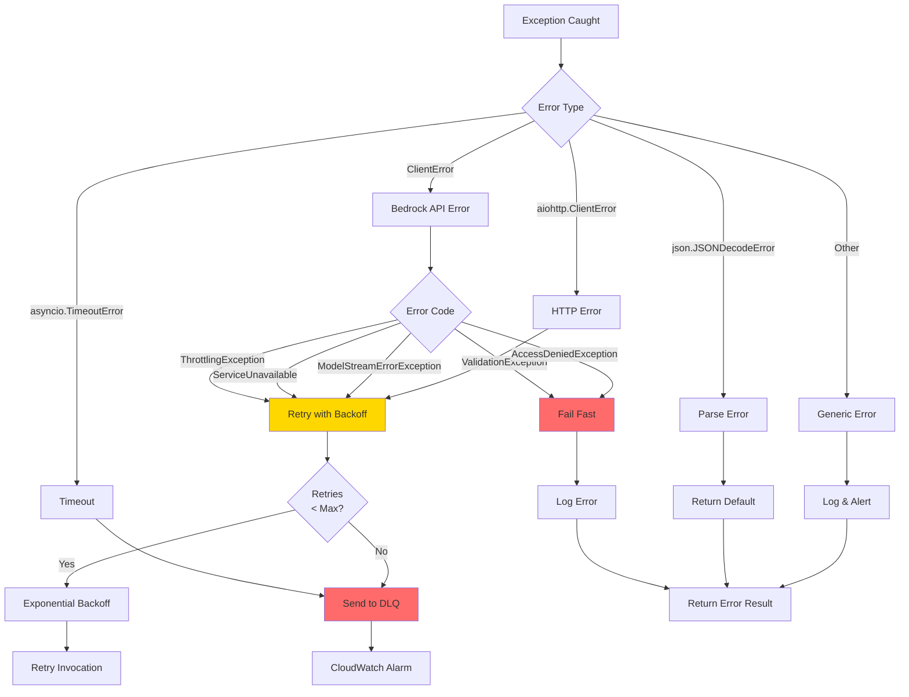

# Low-Level Design: Lambda & Bedrock Agent Execution

## Document Information

| Field | Value |
|-------|-------|
| **Document Type** | Low-Level Design (LLD) |
| **Version** | 1.0 |
| **Date** | 2026-01-30 |
| **Scope** | Lambda Function → Bedrock → External Integrations |
| **Status** | Draft |

---

## 1. Scope Definition

This LLD focuses on the **execution layer** of the PR Peer Review System:



---

## 2. Lambda Function Architecture

### 2.1 Function Overview

| Attribute | Value |
|-----------|-------|
| **Function Name** | `pr-review-agent-orchestrator` |
| **Runtime** | Python 3.11 |
| **Architecture** | arm64 (Graviton2) |
| **Memory** | 1024 MB |
| **Timeout** | 300 seconds (5 minutes) |
| **Handler** | `handler.lambda_handler` |
| **Concurrency** | Reserved: 100 |

### 2.2 Package Structure

```
pr-review-lambda/
├── handler.py                    # Lambda entry point
├── config/
│   ├── __init__.py
│   ├── settings.py              # Environment configuration
│   └── models.py                # Model ID mappings
├── services/
│   ├── __init__.py
│   ├── bedrock_service.py       # Async Bedrock client
│   ├── github_service.py        # GitHub API client
│   ├── jira_service.py          # Jira API client
│   └── confluence_service.py    # Confluence API client
├── agents/
│   ├── __init__.py
│   ├── base_agent.py            # Abstract base agent
│   ├── code_quality_agent.py    # Code quality implementation
│   ├── architect_agent.py       # Architecture review
│   ├── lld_alignment_agent.py   # LLD compliance check
│   └── jira_agent.py            # Ticket creation
├── prompts/
│   ├── code_quality.md          # Agent prompt templates
│   ├── architect.md
│   ├── lld_alignment.md
│   └── jira_integration.md
├── utils/
│   ├── __init__.py
│   ├── diff_chunker.py          # Large diff processing
│   ├── response_parser.py       # JSON extraction
│   ├── result_aggregator.py     # Combine parallel results
│   └── report_generator.py      # Format output
├── models/
│   ├── __init__.py
│   ├── pr_context.py            # PR data models
│   ├── agent_result.py          # Agent response models
│   └── review_report.py         # Final report model
└── requirements.txt
```

### 2.3 Class Diagram



---

## 3. Lambda Handler Implementation

### 3.1 Entry Point

```python
# handler.py
import asyncio
import json
import logging
from typing import Any, Dict

from config.settings import Settings
from services.bedrock_service import BedrockService
from agents.orchestrator import AgentOrchestrator
from models.pr_context import PRContext
from models.review_report import ReviewReport

logger = logging.getLogger(__name__)
logger.setLevel(logging.INFO)

def lambda_handler(event: Dict[str, Any], context: Any) -> Dict[str, Any]:
    """
    Lambda entry point for PR review orchestration.

    Event Schema:
    {
        "pr_number": 123,
        "repository": "org/repo",
        "pr_context": {
            "title": "Feature: Add login",
            "author": "developer",
            "diff": "...",
            "files": ["src/auth.py"],
            "additions": 150,
            "deletions": 20
        },
        "options": {
            "agents": ["code_quality", "architect"],
            "model_override": null,
            "parallel": true
        }
    }
    """
    try:
        # Validate input
        _validate_event(event)

        # Create PR context
        pr_context = PRContext.from_event(event)

        # Get options
        options = event.get("options", {})

        # Run async orchestration
        report = asyncio.run(_run_orchestration(pr_context, options))

        # Return response
        return {
            "statusCode": 200,
            "body": json.dumps(report.to_dict())
        }

    except ValidationError as e:
        logger.error(f"Validation error: {e}")
        return {
            "statusCode": 400,
            "body": json.dumps({"error": str(e)})
        }
    except Exception as e:
        logger.exception(f"Unexpected error: {e}")
        return {
            "statusCode": 500,
            "body": json.dumps({"error": "Internal server error"})
        }


async def _run_orchestration(
    pr_context: PRContext,
    options: Dict[str, Any]
) -> ReviewReport:
    """Run the agent orchestration asynchronously."""
    settings = Settings()
    bedrock_service = BedrockService(
        region=settings.aws_region,
        retry_config=settings.retry_config
    )

    orchestrator = AgentOrchestrator(
        bedrock_service=bedrock_service,
        settings=settings
    )

    return await orchestrator.run_review(
        pr_context=pr_context,
        agents=options.get("agents"),
        parallel=options.get("parallel", True),
        model_override=options.get("model_override")
    )


def _validate_event(event: Dict[str, Any]) -> None:
    """Validate the incoming event structure."""
    required_fields = ["pr_number", "repository", "pr_context"]
    for field in required_fields:
        if field not in event:
            raise ValidationError(f"Missing required field: {field}")

    pr_context = event["pr_context"]
    if not pr_context.get("diff"):
        raise ValidationError("PR diff is required")
```

### 3.2 Event Flow Diagram

```mermaid
flowchart TD
    EVENT[Lambda Event] --> VALIDATE{Validate<br/>Event}

    VALIDATE -->|Invalid| ERROR_400[Return 400<br/>Bad Request]
    VALIDATE -->|Valid| CONTEXT[Create PRContext]

    CONTEXT --> OPTIONS[Extract Options]
    OPTIONS --> ASYNC[asyncio.run()]

    ASYNC --> ORCHESTRATOR[Create Orchestrator]
    ORCHESTRATOR --> AGENTS[Load Agents]

    AGENTS --> PARALLEL{Parallel<br/>Mode?}

    PARALLEL -->|Yes| GATHER[asyncio.gather()]
    PARALLEL -->|No| SEQUENTIAL[Sequential Execution]

    GATHER --> RESULTS[Collect Results]
    SEQUENTIAL --> RESULTS

    RESULTS --> AGGREGATE[Aggregate Results]
    AGGREGATE --> REPORT[Generate Report]

    REPORT --> JIRA_CHECK{Review<br/>Failed?}
    JIRA_CHECK -->|Yes| JIRA[Create Jira Ticket]
    JIRA_CHECK -->|No| RESPONSE

    JIRA --> RESPONSE[Return 200<br/>JSON Response]

    ORCHESTRATOR -.->|Exception| ERROR_500[Return 500<br/>Server Error]

    style ERROR_400 fill:#FF6B6B
    style ERROR_500 fill:#FF6B6B
    style RESPONSE fill:#90EE90
```

---

## 4. Bedrock Service Implementation

### 4.1 Async Bedrock Client

```python
# services/bedrock_service.py
import aioboto3
import asyncio
import logging
from typing import Optional, Dict, Any, AsyncIterator
from botocore.config import Config
from botocore.exceptions import ClientError

from config.models import MODELS
from utils.response_parser import extract_json_from_response

logger = logging.getLogger(__name__)


class BedrockService:
    """Async service for AWS Bedrock Claude model invocations."""

    def __init__(
        self,
        region: str = "us-east-1",
        retry_config: Optional[Dict] = None
    ):
        self.region = region
        self.session = aioboto3.Session()
        self.config = Config(
            retries=retry_config or {
                'max_attempts': 5,
                'mode': 'adaptive'
            },
            connect_timeout=10,
            read_timeout=120
        )
        self._client = None

    async def invoke_model(
        self,
        prompt: str,
        model_id: str,
        temperature: float = 0.2,
        max_tokens: int = 4096,
        top_p: float = 0.9
    ) -> Dict[str, Any]:
        """
        Invoke a Claude model via Bedrock Converse API.

        Args:
            prompt: The user prompt to send
            model_id: Bedrock model identifier
            temperature: Sampling temperature (0.0-1.0)
            max_tokens: Maximum response tokens
            top_p: Top-p sampling parameter

        Returns:
            Dict containing response text and token usage
        """
        async with self.session.client(
            "bedrock-runtime",
            region_name=self.region,
            config=self.config
        ) as client:
            try:
                response = await client.converse(
                    modelId=model_id,
                    messages=[
                        {
                            "role": "user",
                            "content": [{"text": prompt}]
                        }
                    ],
                    inferenceConfig={
                        "maxTokens": max_tokens,
                        "temperature": temperature,
                        "topP": top_p
                    }
                )

                # Extract response content
                response_text = response['output']['message']['content'][0]['text']

                # Extract usage metrics
                usage = response.get('usage', {})

                return {
                    "text": response_text,
                    "input_tokens": usage.get('inputTokens', 0),
                    "output_tokens": usage.get('outputTokens', 0),
                    "stop_reason": response.get('stopReason', 'unknown')
                }

            except ClientError as e:
                await self._handle_error(e)
                raise

    async def invoke_model_streaming(
        self,
        prompt: str,
        model_id: str,
        **kwargs
    ) -> AsyncIterator[str]:
        """
        Invoke model with streaming response.

        Yields:
            Response text chunks as they arrive
        """
        async with self.session.client(
            "bedrock-runtime",
            region_name=self.region,
            config=self.config
        ) as client:
            response = await client.converse_stream(
                modelId=model_id,
                messages=[
                    {"role": "user", "content": [{"text": prompt}]}
                ],
                inferenceConfig={
                    "maxTokens": kwargs.get("max_tokens", 4096),
                    "temperature": kwargs.get("temperature", 0.2)
                }
            )

            async for event in response['stream']:
                if 'contentBlockDelta' in event:
                    delta = event['contentBlockDelta']['delta']
                    if 'text' in delta:
                        yield delta['text']

    async def _handle_error(self, error: ClientError) -> None:
        """Handle and log Bedrock API errors."""
        error_code = error.response['Error']['Code']
        error_msg = error.response['Error']['Message']

        if error_code == 'ThrottlingException':
            logger.warning(f"Rate limited by Bedrock: {error_msg}")
        elif error_code == 'ValidationException':
            logger.error(f"Invalid request to Bedrock: {error_msg}")
        elif error_code == 'AccessDeniedException':
            logger.error(f"Access denied to Bedrock: {error_msg}")
        elif error_code == 'ModelStreamErrorException':
            logger.error(f"Model streaming error: {error_msg}")
        else:
            logger.error(f"Bedrock error [{error_code}]: {error_msg}")
```

### 4.2 Bedrock API Request/Response Flow



### 4.3 Model Configuration

```python
# config/models.py
from dataclasses import dataclass
from typing import Dict


@dataclass
class ModelConfig:
    """Configuration for a Bedrock Claude model."""
    model_id: str
    display_name: str
    input_cost_per_1m: float   # USD per 1M input tokens
    output_cost_per_1m: float  # USD per 1M output tokens
    max_tokens: int
    supports_streaming: bool = True


MODELS: Dict[str, ModelConfig] = {
    "haiku": ModelConfig(
        model_id="anthropic.claude-3-haiku-20240307-v1:0",
        display_name="Claude 3 Haiku",
        input_cost_per_1m=0.25,
        output_cost_per_1m=1.25,
        max_tokens=4096
    ),
    "sonnet": ModelConfig(
        model_id="anthropic.claude-3-5-sonnet-20241022-v2:0",
        display_name="Claude 3.5 Sonnet",
        input_cost_per_1m=3.00,
        output_cost_per_1m=15.00,
        max_tokens=4096
    ),
    "sonnet-4": ModelConfig(
        model_id="anthropic.claude-sonnet-4-20250514-v1:0",
        display_name="Claude Sonnet 4",
        input_cost_per_1m=3.00,
        output_cost_per_1m=15.00,
        max_tokens=8192
    ),
    "opus": ModelConfig(
        model_id="anthropic.claude-opus-4-20250514-v1:0",
        display_name="Claude Opus 4",
        input_cost_per_1m=15.00,
        output_cost_per_1m=75.00,
        max_tokens=4096
    )
}


def get_model_config(model_key: str) -> ModelConfig:
    """Get model configuration by key."""
    if model_key not in MODELS:
        raise ValueError(f"Unknown model: {model_key}. Available: {list(MODELS.keys())}")
    return MODELS[model_key]


def calculate_cost(model_key: str, input_tokens: int, output_tokens: int) -> float:
    """Calculate cost in USD for a model invocation."""
    config = get_model_config(model_key)
    input_cost = (input_tokens / 1_000_000) * config.input_cost_per_1m
    output_cost = (output_tokens / 1_000_000) * config.output_cost_per_1m
    return round(input_cost + output_cost, 6)
```

---

## 5. Agent Implementation

### 5.1 Base Agent Class

```python
# agents/base_agent.py
from abc import ABC, abstractmethod
from dataclasses import dataclass
from typing import Optional, Dict, Any
import time
import logging

from services.bedrock_service import BedrockService
from models.pr_context import PRContext
from models.agent_result import AgentResult
from config.models import get_model_config, calculate_cost

logger = logging.getLogger(__name__)


@dataclass
class AgentConfig:
    """Configuration for an agent."""
    name: str
    model_key: str
    temperature: float
    max_tokens: int
    prompt_template_path: str


class BaseAgent(ABC):
    """Abstract base class for all review agents."""

    def __init__(
        self,
        bedrock_service: BedrockService,
        config: AgentConfig
    ):
        self.bedrock = bedrock_service
        self.config = config
        self._prompt_template: Optional[str] = None

    @property
    def prompt_template(self) -> str:
        """Lazy load prompt template from file."""
        if self._prompt_template is None:
            with open(self.config.prompt_template_path, 'r') as f:
                self._prompt_template = f.read()
        return self._prompt_template

    async def execute(
        self,
        pr_context: PRContext,
        model_override: Optional[str] = None
    ) -> AgentResult:
        """
        Execute the agent's review logic.

        Args:
            pr_context: The PR context to review
            model_override: Optional model to use instead of default

        Returns:
            AgentResult with review findings
        """
        start_time = time.time()

        try:
            # Build prompt
            prompt = self._build_prompt(pr_context)

            # Determine model
            model_key = model_override or self.config.model_key
            model_config = get_model_config(model_key)

            logger.info(f"Executing {self.config.name} with {model_config.display_name}")

            # Invoke model
            response = await self.bedrock.invoke_model(
                prompt=prompt,
                model_id=model_config.model_id,
                temperature=self.config.temperature,
                max_tokens=self.config.max_tokens
            )

            # Parse response
            parsed = self._parse_response(response['text'])

            # Calculate metrics
            execution_time_ms = int((time.time() - start_time) * 1000)
            cost = calculate_cost(
                model_key,
                response['input_tokens'],
                response['output_tokens']
            )

            return AgentResult(
                agent_name=self.config.name,
                status=parsed.get('status', 'UNKNOWN'),
                details=parsed,
                input_tokens=response['input_tokens'],
                output_tokens=response['output_tokens'],
                cost_usd=cost,
                execution_time_ms=execution_time_ms,
                model_used=model_key
            )

        except Exception as e:
            logger.exception(f"Agent {self.config.name} failed: {e}")
            execution_time_ms = int((time.time() - start_time) * 1000)
            return AgentResult(
                agent_name=self.config.name,
                status="ERROR",
                details={"error": str(e)},
                execution_time_ms=execution_time_ms,
                model_used=model_override or self.config.model_key
            )

    def _build_prompt(self, pr_context: PRContext) -> str:
        """Build the complete prompt for the model."""
        return f"""{self.prompt_template}

<pull_request>
<metadata>
PR Number: #{pr_context.pr_number}
Title: {pr_context.title}
Author: {pr_context.author}
Files Changed: {len(pr_context.files)}
Additions: {pr_context.additions}
Deletions: {pr_context.deletions}
</metadata>

<files>
{chr(10).join(pr_context.files[:50])}
</files>

<diff>
{pr_context.diff[:100000]}
</diff>
</pull_request>

Analyze this pull request and provide your review as valid JSON only.
Do not include any markdown formatting or code blocks - just the raw JSON object."""

    @abstractmethod
    def _parse_response(self, response_text: str) -> Dict[str, Any]:
        """Parse the model's response into structured data."""
        pass
```

### 5.2 Code Quality Agent

```python
# agents/code_quality_agent.py
import json
import re
from typing import Dict, Any, List

from agents.base_agent import BaseAgent, AgentConfig


class CodeQualityAgent(BaseAgent):
    """Agent for checking code quality and best practices."""

    DEFAULT_CONFIG = AgentConfig(
        name="Code Quality Agent",
        model_key="haiku",
        temperature=0.2,
        max_tokens=4096,
        prompt_template_path="prompts/code_quality.md"
    )

    def _parse_response(self, response_text: str) -> Dict[str, Any]:
        """
        Parse code quality response.

        Expected format:
        {
            "status": "PASS" | "FAIL",
            "violations_count": int,
            "violations": [
                {
                    "type": "bug" | "security" | "style" | "performance",
                    "severity": "LOW" | "MEDIUM" | "HIGH" | "CRITICAL",
                    "file": "path/to/file.py",
                    "line": 42,
                    "description": "Issue description",
                    "suggestion": "How to fix"
                }
            ],
            "summary": "Brief assessment"
        }
        """
        try:
            # Clean markdown formatting if present
            cleaned = re.sub(r'```(?:json)?\s*', '', response_text)
            cleaned = re.sub(r'```\s*$', '', cleaned).strip()

            parsed = json.loads(cleaned)

            # Validate structure
            if 'status' not in parsed:
                parsed['status'] = 'FAIL' if parsed.get('violations') else 'PASS'

            if 'violations' not in parsed:
                parsed['violations'] = []

            parsed['violations_count'] = len(parsed['violations'])

            return parsed

        except json.JSONDecodeError as e:
            return {
                "status": "ERROR",
                "violations_count": 0,
                "violations": [],
                "summary": f"Failed to parse response: {e}",
                "_raw": response_text[:1000]
            }
```

### 5.3 Agent Execution Flow

```mermaid
flowchart TD
    subgraph "Agent Execution"
        START([execute()]) --> BUILD[Build Prompt]
        BUILD --> MODEL[Get Model Config]
        MODEL --> INVOKE[Invoke Bedrock]

        INVOKE --> RESPONSE{Response<br/>OK?}

        RESPONSE -->|Success| PARSE[Parse JSON]
        RESPONSE -->|Error| ERROR_RESULT[Create Error Result]

        PARSE --> VALIDATE{Valid<br/>JSON?}

        VALIDATE -->|Yes| METRICS[Calculate Metrics]
        VALIDATE -->|No| FALLBACK[Use Fallback Parser]

        FALLBACK --> METRICS
        METRICS --> RESULT[Create AgentResult]
        ERROR_RESULT --> RESULT

        RESULT --> RETURN([Return Result])
    end

    subgraph "AgentResult"
        R1[agent_name]
        R2[status]
        R3[details]
        R4[input_tokens]
        R5[output_tokens]
        R6[cost_usd]
        R7[execution_time_ms]
    end

    RESULT --> R1
    RESULT --> R2
    RESULT --> R3
    RESULT --> R4
    RESULT --> R5
    RESULT --> R6
    RESULT --> R7
```

---

## 6. Agent Orchestrator

### 6.1 Orchestrator Implementation

```python
# agents/orchestrator.py
import asyncio
import logging
from typing import List, Dict, Optional, Any
from dataclasses import dataclass

from services.bedrock_service import BedrockService
from services.jira_service import JiraService
from agents.code_quality_agent import CodeQualityAgent
from agents.architect_agent import ArchitectAgent
from agents.lld_alignment_agent import LLDAlignmentAgent
from agents.jira_agent import JiraAgent
from models.pr_context import PRContext
from models.agent_result import AgentResult
from models.review_report import ReviewReport
from config.settings import Settings

logger = logging.getLogger(__name__)


class AgentOrchestrator:
    """Orchestrates the execution of multiple review agents."""

    def __init__(
        self,
        bedrock_service: BedrockService,
        settings: Settings
    ):
        self.bedrock = bedrock_service
        self.settings = settings
        self.jira_service = JiraService(
            base_url=settings.jira_base_url,
            api_token=settings.jira_api_token,
            user_email=settings.jira_user_email
        )

        # Initialize agents
        self.agents = {
            "code_quality": CodeQualityAgent(bedrock_service),
            "architect": ArchitectAgent(bedrock_service),
            "lld_alignment": LLDAlignmentAgent(bedrock_service),
            "jira": JiraAgent(bedrock_service, self.jira_service)
        }

    async def run_review(
        self,
        pr_context: PRContext,
        agents: Optional[List[str]] = None,
        parallel: bool = True,
        model_override: Optional[str] = None
    ) -> ReviewReport:
        """
        Run the complete review pipeline.

        Args:
            pr_context: PR context to review
            agents: Specific agents to run (default: determined by flow)
            parallel: Whether to run agents in parallel
            model_override: Optional model override for all agents

        Returns:
            Complete review report
        """
        logger.info(f"Starting review for PR #{pr_context.pr_number}")

        results: Dict[str, AgentResult] = {}

        # Phase 1: Code Quality (always runs first)
        cq_result = await self.agents["code_quality"].execute(
            pr_context, model_override
        )
        results["code_quality"] = cq_result

        # Early exit if code quality fails
        if cq_result.status == "FAIL":
            logger.info("Code quality failed, skipping further agents")
            return await self._finalize_report(
                pr_context, results, failed=True
            )

        # Phase 2: Parallel execution of remaining agents
        if parallel:
            parallel_results = await self._run_parallel(
                ["architect"],  # LLD only if architect finds pattern
                pr_context,
                model_override
            )
            results.update(parallel_results)
        else:
            arch_result = await self.agents["architect"].execute(
                pr_context, model_override
            )
            results["architect"] = arch_result

        # Phase 3: Conditional LLD check
        arch_result = results.get("architect")
        if arch_result and arch_result.details.get("new_pattern_found"):
            logger.info("New pattern detected, running LLD alignment")
            lld_result = await self.agents["lld_alignment"].execute(
                pr_context, model_override
            )
            results["lld_alignment"] = lld_result

        # Finalize report
        return await self._finalize_report(pr_context, results)

    async def _run_parallel(
        self,
        agent_names: List[str],
        pr_context: PRContext,
        model_override: Optional[str]
    ) -> Dict[str, AgentResult]:
        """Run multiple agents in parallel using asyncio.gather."""

        async def run_agent(name: str) -> tuple:
            agent = self.agents.get(name)
            if not agent:
                raise ValueError(f"Unknown agent: {name}")
            result = await agent.execute(pr_context, model_override)
            return name, result

        tasks = [run_agent(name) for name in agent_names]
        results = await asyncio.gather(*tasks, return_exceptions=True)

        output = {}
        for result in results:
            if isinstance(result, Exception):
                logger.error(f"Agent failed: {result}")
            else:
                name, agent_result = result
                output[name] = agent_result

        return output

    async def _finalize_report(
        self,
        pr_context: PRContext,
        results: Dict[str, AgentResult],
        failed: bool = False
    ) -> ReviewReport:
        """Finalize the review report and create Jira ticket if needed."""

        # Determine overall status
        if failed or any(r.status in ["FAIL", "LLD_DEVIATION_FOUND"]
                        for r in results.values()):
            overall_status = "BLOCKED"
            can_merge = False

            # Create Jira ticket
            jira_result = await self.agents["jira"].execute(
                pr_context=pr_context,
                failure_results=[r for r in results.values()
                               if r.status in ["FAIL", "LLD_DEVIATION_FOUND", "ERROR"]]
            )
            jira_ticket = jira_result.details.get("ticket_key")

        elif any(r.status == "NEW_PATTERN_DETECTED" for r in results.values()):
            overall_status = "WAITING_REVIEW"
            can_merge = False
            jira_ticket = None

        else:
            overall_status = "APPROVED"
            can_merge = True
            jira_ticket = None

        # Calculate total cost
        total_cost = sum(r.cost_usd or 0 for r in results.values())

        return ReviewReport(
            pr_number=pr_context.pr_number,
            overall_status=overall_status,
            can_merge=can_merge,
            agent_results=list(results.values()),
            jira_ticket=jira_ticket,
            total_cost=total_cost
        )
```

### 6.2 Orchestration Flow Diagram

```mermaid
flowchart TD
    START([run_review()]) --> CQ[Code Quality Agent]

    CQ --> CQ_CHECK{Code Quality<br/>Result}

    CQ_CHECK -->|FAIL| EARLY_EXIT[Early Exit]
    CQ_CHECK -->|PASS| PARALLEL_CHECK{Parallel<br/>Mode?}

    PARALLEL_CHECK -->|Yes| GATHER[asyncio.gather()]
    PARALLEL_CHECK -->|No| SEQUENTIAL[Sequential]

    subgraph "Parallel Execution"
        GATHER --> ARCH_P[Architect Agent]
    end

    subgraph "Sequential Execution"
        SEQUENTIAL --> ARCH_S[Architect Agent]
    end

    ARCH_P --> ARCH_RESULT
    ARCH_S --> ARCH_RESULT

    ARCH_RESULT{New Pattern<br/>Found?}

    ARCH_RESULT -->|Yes| LLD[LLD Alignment Agent]
    ARCH_RESULT -->|No| FINALIZE

    LLD --> FINALIZE[Finalize Report]
    EARLY_EXIT --> FINALIZE

    FINALIZE --> STATUS_CHECK{Overall<br/>Status}

    STATUS_CHECK -->|BLOCKED| JIRA[Create Jira Ticket]
    STATUS_CHECK -->|APPROVED| REPORT
    STATUS_CHECK -->|WAITING_REVIEW| REPORT

    JIRA --> REPORT[Generate ReviewReport]

    REPORT --> RETURN([Return Report])

    style CQ fill:#90EE90
    style ARCH_P fill:#87CEEB
    style ARCH_S fill:#87CEEB
    style LLD fill:#87CEEB
    style JIRA fill:#FFD700
```

---

## 7. Jira Integration

### 7.1 Jira Service Implementation

```python
# services/jira_service.py
import aiohttp
import base64
import logging
from typing import Optional, Dict, Any

logger = logging.getLogger(__name__)


class JiraService:
    """Async service for Jira API operations."""

    def __init__(
        self,
        base_url: str,
        api_token: str,
        user_email: str
    ):
        self.base_url = base_url.rstrip('/')
        self.api_token = api_token
        self.user_email = user_email
        self._auth_header = self._create_auth_header()

    def _create_auth_header(self) -> str:
        """Create Basic auth header for Jira API."""
        credentials = f"{self.user_email}:{self.api_token}"
        encoded = base64.b64encode(credentials.encode()).decode()
        return f"Basic {encoded}"

    async def create_issue(
        self,
        project_key: str,
        summary: str,
        description: Dict[str, Any],
        issue_type: str = "Bug",
        priority: str = "High",
        labels: Optional[list] = None,
        assignee_email: Optional[str] = None
    ) -> Dict[str, Any]:
        """
        Create a Jira issue.

        Args:
            project_key: Jira project key (e.g., "SCM")
            summary: Issue summary/title
            description: ADF format description
            issue_type: Issue type name
            priority: Priority name
            labels: List of labels
            assignee_email: Email of assignee

        Returns:
            Created issue data including key and URL
        """
        url = f"{self.base_url}/rest/api/3/issue"

        payload = {
            "fields": {
                "project": {"key": project_key},
                "summary": summary,
                "description": description,
                "issuetype": {"name": issue_type},
                "priority": {"name": priority},
                "labels": labels or []
            }
        }

        if assignee_email:
            # Look up account ID by email
            account_id = await self._get_account_id(assignee_email)
            if account_id:
                payload["fields"]["assignee"] = {"accountId": account_id}

        async with aiohttp.ClientSession() as session:
            async with session.post(
                url,
                json=payload,
                headers={
                    "Authorization": self._auth_header,
                    "Content-Type": "application/json"
                }
            ) as response:
                if response.status == 201:
                    data = await response.json()
                    return {
                        "key": data["key"],
                        "id": data["id"],
                        "url": f"{self.base_url}/browse/{data['key']}"
                    }
                else:
                    error = await response.text()
                    logger.error(f"Failed to create Jira issue: {error}")
                    raise JiraAPIError(f"Failed to create issue: {response.status}")

    async def _get_account_id(self, email: str) -> Optional[str]:
        """Look up Jira account ID by email."""
        url = f"{self.base_url}/rest/api/3/user/search"

        async with aiohttp.ClientSession() as session:
            async with session.get(
                url,
                params={"query": email},
                headers={"Authorization": self._auth_header}
            ) as response:
                if response.status == 200:
                    users = await response.json()
                    if users:
                        return users[0]["accountId"]
        return None


class JiraAPIError(Exception):
    """Exception for Jira API errors."""
    pass
```

### 7.2 Jira Ticket Creation Flow



### 7.3 Jira ADF Description Format

```python
def build_jira_description(
    pr_context: PRContext,
    failure_results: List[AgentResult]
) -> Dict[str, Any]:
    """
    Build Jira description in Atlassian Document Format (ADF).
    """
    content = [
        # Error panel
        {
            "type": "panel",
            "attrs": {"panelType": "error"},
            "content": [{
                "type": "paragraph",
                "content": [{
                    "type": "text",
                    "text": "Automated PR review detected issues requiring attention."
                }]
            }]
        },
        # PR Info
        {
            "type": "heading",
            "attrs": {"level": 2},
            "content": [{"type": "text", "text": "Pull Request Details"}]
        },
        {
            "type": "bulletList",
            "content": [
                _bullet(f"PR: #{pr_context.pr_number}"),
                _bullet(f"Title: {pr_context.title}"),
                _bullet(f"Author: {pr_context.author}"),
                _bullet(f"Files Changed: {len(pr_context.files)}")
            ]
        },
        # Findings
        {
            "type": "heading",
            "attrs": {"level": 2},
            "content": [{"type": "text", "text": "Review Findings"}]
        }
    ]

    # Add findings from each failed agent
    for result in failure_results:
        content.append({
            "type": "heading",
            "attrs": {"level": 3},
            "content": [{"type": "text", "text": result.agent_name}]
        })

        if result.details.get("violations"):
            for v in result.details["violations"][:5]:
                content.append({
                    "type": "bulletList",
                    "content": [
                        _bullet(f"[{v['severity']}] {v['file']}:{v.get('line', '?')}"),
                        _bullet(f"  {v['description']}")
                    ]
                })

    return {
        "type": "doc",
        "version": 1,
        "content": content
    }
```

---

## 8. Diff Processing

### 8.1 Diff Chunker Implementation

```python
# utils/diff_chunker.py
import re
from typing import List, Tuple
from dataclasses import dataclass


@dataclass
class DiffChunk:
    """A chunk of diff content."""
    chunk_number: int
    total_chunks: int
    files: List[str]
    content: str
    char_count: int


class DiffChunker:
    """Utility for splitting large diffs into processable chunks."""

    DEFAULT_MAX_CHARS = 50000  # ~12,500 tokens

    def __init__(self, max_chars: int = DEFAULT_MAX_CHARS):
        self.max_chars = max_chars

    def chunk_diff(self, diff: str) -> List[DiffChunk]:
        """
        Split a diff into chunks by file boundaries.

        Args:
            diff: The complete diff string

        Returns:
            List of DiffChunk objects
        """
        if len(diff) <= self.max_chars:
            return [DiffChunk(
                chunk_number=1,
                total_chunks=1,
                files=self._extract_files(diff),
                content=diff,
                char_count=len(diff)
            )]

        # Split by file
        file_pattern = r'(diff --git a/.*?(?=diff --git a/|\Z))'
        file_diffs = re.findall(file_pattern, diff, re.DOTALL)

        chunks = []
        current_content = ""
        current_files = []

        for file_diff in file_diffs:
            file_name = self._extract_file_name(file_diff)

            # Check if adding this file exceeds limit
            if len(current_content) + len(file_diff) > self.max_chars:
                if current_content:
                    chunks.append(self._create_chunk(
                        len(chunks) + 1,
                        current_files,
                        current_content
                    ))
                current_content = file_diff
                current_files = [file_name]
            else:
                current_content += file_diff
                current_files.append(file_name)

        # Add remaining content
        if current_content:
            chunks.append(self._create_chunk(
                len(chunks) + 1,
                current_files,
                current_content
            ))

        # Update total_chunks
        total = len(chunks)
        for chunk in chunks:
            chunk.total_chunks = total

        return chunks

    def _extract_files(self, diff: str) -> List[str]:
        """Extract file names from diff."""
        pattern = r'diff --git a/(.*?) b/'
        return re.findall(pattern, diff)

    def _extract_file_name(self, file_diff: str) -> str:
        """Extract single file name from file diff section."""
        match = re.search(r'diff --git a/(.*?) b/', file_diff)
        return match.group(1) if match else "unknown"

    def _create_chunk(
        self,
        number: int,
        files: List[str],
        content: str
    ) -> DiffChunk:
        """Create a DiffChunk object."""
        return DiffChunk(
            chunk_number=number,
            total_chunks=0,  # Updated later
            files=files,
            content=content,
            char_count=len(content)
        )
```

### 8.2 Chunked Processing Flow

```mermaid
flowchart TD
    DIFF[Large Diff<br/>> 50K chars] --> CHUNKER[DiffChunker]

    CHUNKER --> SPLIT[Split by File<br/>Boundaries]

    SPLIT --> CHUNKS[DiffChunk 1<br/>DiffChunk 2<br/>DiffChunk 3<br/>...]

    CHUNKS --> PARALLEL[Parallel Processing<br/>asyncio.gather()]

    subgraph "Parallel Chunk Processing"
        C1[Process Chunk 1] --> R1[Result 1]
        C2[Process Chunk 2] --> R2[Result 2]
        C3[Process Chunk 3] --> R3[Result 3]
    end

    PARALLEL --> C1
    PARALLEL --> C2
    PARALLEL --> C3

    R1 --> AGGREGATE[Aggregate Results]
    R2 --> AGGREGATE
    R3 --> AGGREGATE

    AGGREGATE --> MERGE[Merge Violations<br/>Deduplicate]
    MERGE --> FINAL[Final Result]
```

### 8.3 Chunk Aggregation

```python
# utils/result_aggregator.py
from typing import List, Dict, Any
from models.agent_result import AgentResult


class ResultAggregator:
    """Aggregate results from multiple chunks or agents."""

    @staticmethod
    def aggregate_code_quality(results: List[Dict]) -> Dict[str, Any]:
        """Aggregate code quality results from multiple chunks."""
        all_violations = []

        for result in results:
            violations = result.get("violations", [])
            all_violations.extend(violations)

        # Deduplicate by file + line
        seen = set()
        unique_violations = []
        for v in all_violations:
            key = (v.get("file"), v.get("line"), v.get("description"))
            if key not in seen:
                seen.add(key)
                unique_violations.append(v)

        return {
            "status": "FAIL" if unique_violations else "PASS",
            "violations_count": len(unique_violations),
            "violations": unique_violations,
            "summary": f"Aggregated from {len(results)} chunks"
        }

    @staticmethod
    def aggregate_architect(results: List[Dict]) -> Dict[str, Any]:
        """Aggregate architect results from multiple chunks."""
        all_patterns = []

        for result in results:
            patterns = result.get("patterns", [])
            all_patterns.extend(patterns)

        new_pattern_found = any(
            r.get("new_pattern_found", False) for r in results
        )

        return {
            "status": "NEW_PATTERN_DETECTED" if new_pattern_found else "NO_NEW_PATTERN",
            "new_pattern_found": new_pattern_found,
            "patterns": all_patterns,
            "summary": f"Aggregated from {len(results)} chunks"
        }
```

---

## 9. Error Handling

### 9.1 Error Classification



### 9.2 Retry Configuration

```python
# config/settings.py
from dataclasses import dataclass, field
from typing import Dict, Any
import os


@dataclass
class RetryConfig:
    """Configuration for retry behavior."""
    max_attempts: int = 3
    base_delay_seconds: float = 1.0
    max_delay_seconds: float = 60.0
    exponential_base: float = 2.0
    jitter: bool = True

    def get_delay(self, attempt: int) -> float:
        """Calculate delay for given attempt number."""
        import random

        delay = min(
            self.base_delay_seconds * (self.exponential_base ** attempt),
            self.max_delay_seconds
        )

        if self.jitter:
            delay += random.uniform(0, 1)

        return delay


@dataclass
class Settings:
    """Application settings loaded from environment."""

    # AWS
    aws_region: str = field(
        default_factory=lambda: os.environ.get("AWS_REGION", "us-east-1")
    )

    # Models
    default_model: str = field(
        default_factory=lambda: os.environ.get("DEFAULT_MODEL", "haiku")
    )

    # Jira
    jira_base_url: str = field(
        default_factory=lambda: os.environ.get("JIRA_BASE_URL", "")
    )
    jira_api_token: str = field(
        default_factory=lambda: os.environ.get("JIRA_API_TOKEN", "")
    )
    jira_user_email: str = field(
        default_factory=lambda: os.environ.get("JIRA_USER_EMAIL", "")
    )
    jira_project_key: str = field(
        default_factory=lambda: os.environ.get("JIRA_PROJECT_KEY", "SCM")
    )

    # Processing
    max_diff_chars: int = field(
        default_factory=lambda: int(os.environ.get("MAX_DIFF_CHARS", "100000"))
    )

    # Retry
    retry_config: Dict[str, Any] = field(default_factory=lambda: {
        'max_attempts': 5,
        'mode': 'adaptive'
    })
```

---

## 10. Data Models

### 10.1 PR Context Model

```python
# models/pr_context.py
from dataclasses import dataclass, field
from typing import List, Optional, Dict, Any


@dataclass
class PRContext:
    """Context information for a pull request."""

    pr_number: int
    repository: str
    title: str
    author: str
    diff: str
    files: List[str] = field(default_factory=list)
    description: Optional[str] = None
    additions: int = 0
    deletions: int = 0
    base_branch: str = "main"
    head_branch: str = ""

    @classmethod
    def from_event(cls, event: Dict[str, Any]) -> "PRContext":
        """Create PRContext from Lambda event."""
        pr_data = event.get("pr_context", {})

        return cls(
            pr_number=event["pr_number"],
            repository=event["repository"],
            title=pr_data.get("title", ""),
            author=pr_data.get("author", ""),
            diff=pr_data.get("diff", ""),
            files=pr_data.get("files", []),
            description=pr_data.get("description"),
            additions=pr_data.get("additions", 0),
            deletions=pr_data.get("deletions", 0),
            base_branch=pr_data.get("base_branch", "main"),
            head_branch=pr_data.get("head_branch", "")
        )

    @property
    def files_changed_count(self) -> int:
        """Number of files changed."""
        return len(self.files)

    @property
    def is_large_pr(self) -> bool:
        """Check if this is a large PR."""
        return len(self.diff) > 50000 or self.files_changed_count > 30
```

### 10.2 Agent Result Model

```python
# models/agent_result.py
from dataclasses import dataclass, field
from typing import Dict, Any, Optional
from datetime import datetime


@dataclass
class AgentResult:
    """Result from an agent execution."""

    agent_name: str
    status: str  # PASS, FAIL, ERROR, NEW_PATTERN_DETECTED, etc.
    details: Dict[str, Any] = field(default_factory=dict)
    input_tokens: int = 0
    output_tokens: int = 0
    cost_usd: Optional[float] = None
    execution_time_ms: int = 0
    model_used: str = ""
    timestamp: datetime = field(default_factory=datetime.utcnow)

    def to_dict(self) -> Dict[str, Any]:
        """Convert to dictionary for JSON serialization."""
        return {
            "agent_name": self.agent_name,
            "status": self.status,
            "details": self.details,
            "metrics": {
                "input_tokens": self.input_tokens,
                "output_tokens": self.output_tokens,
                "cost_usd": self.cost_usd,
                "execution_time_ms": self.execution_time_ms
            },
            "model_used": self.model_used,
            "timestamp": self.timestamp.isoformat()
        }
```

### 10.3 Review Report Model

```python
# models/review_report.py
from dataclasses import dataclass, field
from typing import List, Optional, Dict, Any
from datetime import datetime

from models.agent_result import AgentResult


@dataclass
class ReviewReport:
    """Complete review report for a PR."""

    pr_number: int
    overall_status: str  # APPROVED, BLOCKED, WAITING_REVIEW
    can_merge: bool
    agent_results: List[AgentResult] = field(default_factory=list)
    jira_ticket: Optional[str] = None
    jira_url: Optional[str] = None
    total_cost: float = 0.0
    started_at: datetime = field(default_factory=datetime.utcnow)
    completed_at: Optional[datetime] = None

    def to_dict(self) -> Dict[str, Any]:
        """Convert to dictionary for JSON serialization."""
        return {
            "pr_number": self.pr_number,
            "overall_status": self.overall_status,
            "can_merge": self.can_merge,
            "agent_results": [r.to_dict() for r in self.agent_results],
            "jira": {
                "ticket": self.jira_ticket,
                "url": self.jira_url
            } if self.jira_ticket else None,
            "metrics": {
                "total_cost_usd": self.total_cost,
                "total_input_tokens": sum(r.input_tokens for r in self.agent_results),
                "total_output_tokens": sum(r.output_tokens for r in self.agent_results),
                "total_execution_time_ms": sum(r.execution_time_ms for r in self.agent_results)
            },
            "started_at": self.started_at.isoformat(),
            "completed_at": self.completed_at.isoformat() if self.completed_at else None
        }

    def get_summary(self) -> str:
        """Generate human-readable summary."""
        status_emoji = {
            "APPROVED": "✅",
            "BLOCKED": "❌",
            "WAITING_REVIEW": "⏳"
        }

        lines = [
            f"## PR Review Report",
            f"",
            f"**Status**: {status_emoji.get(self.overall_status, '❓')} {self.overall_status}",
            f"**Can Merge**: {'Yes' if self.can_merge else 'No'}",
            f""
        ]

        if self.jira_ticket:
            lines.append(f"**Jira Ticket**: [{self.jira_ticket}]({self.jira_url})")
            lines.append("")

        lines.append("### Agent Results")
        lines.append("")
        lines.append("| Agent | Status | Time | Cost |")
        lines.append("|-------|--------|------|------|")

        for result in self.agent_results:
            lines.append(
                f"| {result.agent_name} | {result.status} | "
                f"{result.execution_time_ms}ms | ${result.cost_usd:.4f} |"
            )

        return "\n".join(lines)
```

---

## 11. Lambda Layer Configuration

### 11.1 Layer Structure

```
layer/
├── python/
│   ├── aioboto3/
│   ├── aiobotocore/
│   ├── aiohttp/
│   ├── aioitertools/
│   └── pydantic/
└── requirements.txt
```

### 11.2 Layer Build Script

```bash
#!/bin/bash
# build_layer.sh

set -e

LAYER_NAME="pr-review-dependencies"
PYTHON_VERSION="3.11"

# Create layer directory
mkdir -p layer/python

# Install dependencies
pip install \
    --platform manylinux2014_aarch64 \
    --target layer/python \
    --implementation cp \
    --python-version $PYTHON_VERSION \
    --only-binary=:all: \
    aioboto3>=13.1.0 \
    aiobotocore>=2.13.0 \
    aiohttp>=3.9.0 \
    pydantic>=2.0.0

# Package layer
cd layer
zip -r9 ../${LAYER_NAME}.zip python

echo "Layer created: ${LAYER_NAME}.zip"
```

---

## 12. Appendix

### 12.1 Environment Variables Reference

| Variable | Required | Default | Description |
|----------|----------|---------|-------------|
| `AWS_REGION` | No | `us-east-1` | AWS region for Bedrock |
| `DEFAULT_MODEL` | No | `haiku` | Default model key |
| `CODE_QUALITY_MODEL` | No | `haiku` | Model for code quality |
| `ARCHITECT_MODEL` | No | `sonnet` | Model for architect |
| `LLD_MODEL` | No | `sonnet` | Model for LLD alignment |
| `JIRA_BASE_URL` | Yes | - | Jira instance URL |
| `JIRA_API_TOKEN` | Yes | - | Jira API token |
| `JIRA_USER_EMAIL` | Yes | - | Jira service account email |
| `JIRA_PROJECT_KEY` | No | `SCM` | Default Jira project |
| `MAX_DIFF_CHARS` | No | `100000` | Max diff size per call |
| `LOG_LEVEL` | No | `INFO` | Logging verbosity |

### 12.2 API Response Codes

| Code | Meaning | Action |
|------|---------|--------|
| 200 | Success | Process result |
| 400 | Bad Request | Check input validation |
| 401 | Unauthorized | Check credentials |
| 403 | Forbidden | Check IAM permissions |
| 429 | Rate Limited | Retry with backoff |
| 500 | Server Error | Check logs, retry |
| 503 | Service Unavailable | Retry with backoff |

### 12.3 Glossary

| Term | Definition |
|------|------------|
| **ADF** | Atlassian Document Format - Jira's rich text format |
| **Converse API** | Bedrock's unified chat API for Claude models |
| **aioboto3** | Async Python SDK for AWS services |
| **DLQ** | Dead Letter Queue - for failed messages |
| **TPM** | Tokens Per Minute - rate limit metric |

---

**End of Low-Level Design Document**
