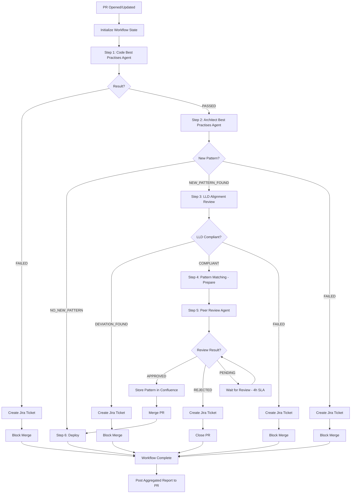

# Agent Specification: PR Orchestrator Agent

**Created**: 2026-01-28
**Project**: Tonic Configuration Management Platform
**LLD Reference**: lld_1_config_management_platform.md

---

## Question 1: Agent Identity and Purpose

**What is this agent and what problem does it solve?**

The PR Orchestrator Agent is a workflow coordination and decision-making agent that orchestrates the execution of all peer review agents and makes final merge decisions for GitHub Pull Requests. This agent solves the problem of complex multi-agent workflow management by providing centralized coordination, state management, error aggregation, and intelligent routing between agents.

**Problem Solved**: Without centralized orchestration, multi-agent workflows become fragmented with unclear responsibility boundaries, inconsistent error handling, lost context between agents, and difficulty tracking overall PR status. This agent provides a single source of truth for PR workflow state and ensures correct sequential execution of all validation steps.

**Value Provided**:
- Centralized workflow coordination for all 6 peer review agents
- Intelligent routing based on agent outputs (sequential and conditional execution)
- Aggregated reporting of all validation results
- Final merge decision authority based on complete validation state
- SLA monitoring across entire workflow (~4.5 hours including human review)
- Error handling and retry logic for agent failures
- Complete audit trail of workflow execution
- Management visibility into PR processing metrics

---

## Question 2: Core Capabilities

**What are the agent's main capabilities?**

1. **Workflow Orchestration**: Execute agents in correct sequential order:
   - Step 1: Code Best Practises Agent (30 seconds)
   - Step 2: Architect Best Practises Agent (10 seconds)
   - Step 3: LLD Alignment Review Agent (20 seconds) [conditional]
   - Step 4: Pattern Matching Agent (2 seconds) [conditional]
   - Step 5: Peer Review Documentation Agent (4 hours) [conditional]
   - Step 6: GitHub Actions Workflows Hooks (deployment)
   - Step 7: Jira Integration Agent (conditional on failures)

2. **Intelligent Routing**: Make routing decisions based on agent outputs:
   - If Architect Agent finds no new patterns → Skip to deployment (Steps 3-5)
   - If Architect Agent finds new patterns → Route through LLD Review → Pattern Storage → Peer Review
   - If any agent fails → Route to Jira Integration Agent

3. **State Management**: Maintain complete workflow state:
   - Current step in workflow
   - Agent execution results
   - Approval/rejection status per agent
   - Accumulated violations/deviations
   - Timing metrics per agent
   - Overall workflow SLA tracking

4. **Merge Decision Logic**: Make final merge decision based on:
   - All required agents passed
   - No blocking violations or deviations
   - Human approvals received (if required)
   - CI/CD pipeline status (all checks passed)

5. **Error Aggregation**: Collect and aggregate errors:
   - Code violations (from Code Best Practises Agent)
   - LLD deviations (from LLD Alignment Review Agent)
   - Pattern rejections (from Peer Review Agent)
   - Agent execution failures

6. **SLA Monitoring**: Track and enforce SLAs:
   - Individual agent SLAs
   - Overall workflow SLA (4.5 hours)
   - Human review SLA (4 hours)
   - Alert on SLA breaches

7. **Retry Logic**: Handle transient failures with intelligent retry:
   - Exponential backoff for API failures
   - Circuit breaker for cascading failures
   - Maximum retry attempts per agent (3 retries)

8. **Notification Management**: Send notifications at key workflow points:
   - Workflow started
   - Agent failures
   - Human review required
   - Merge decision (approve/block)
   - SLA breach warnings

---

## Question 3: Input Requirements

**What inputs does the agent need?**

**Primary Inputs**:
- **GitHub PR Event**: PR webhook payload (opened, synchronized, reopened)
  - PR number
  - Repository name
  - Branch names (source, target)
  - Author information
  - Commit SHA
  - Modified files list
  - PR title and description

**External Data Sources**:
- **GitHub API**: PR status, reviews, CI checks, branch protection rules
- **Agent APIs**: Execution endpoints for all 6 peer review agents
- **CloudWatch**: Metrics and logs for monitoring
- **Configuration Store**: Workflow configuration, SLA thresholds, routing rules

**Format**: JSON payload from GitHub Actions webhook

**Example Input**:
```json
{
  "event": "pull_request.opened",
  "pr_number": 123,
  "repository": "tonic-scm/order-service",
  "source_branch": "feature/new-repository-pattern",
  "target_branch": "main",
  "author": "developer1",
  "commits": ["abc123"],
  "modified_files": [
    "src/main/java/com/tonic/order/OrderRepository.java",
    "src/test/java/com/tonic/order/OrderRepositoryTest.java"
  ],
  "pr_title": "Add repository pattern with caching",
  "pr_description": "Implements repository pattern for order data access with Spring Cache"
}
```

**Preconditions**:
- GitHub Actions workflow configured to trigger orchestrator on PR events
- All agent APIs are deployed and accessible
- Agent API credentials available in GitHub Secrets
- Branch protection rules configured for target branch

---

## Question 4: Output Specifications

**What does the agent produce?**

**Primary Outputs**:
- **Merge Decision**: APPROVE_MERGE / BLOCK_MERGE / PENDING_REVIEW
- **Workflow Status**: RUNNING / COMPLETED_SUCCESS / COMPLETED_FAILURE / PENDING_HUMAN_REVIEW
- **Aggregated Report**: Complete validation results from all agents
- **GitHub PR Status Check**: Posted to PR as status check
- **GitHub PR Comment**: Summary of all validation results

**Aggregated Report Structure**:
```json
{
  "pr_number": 123,
  "repository": "tonic-scm/order-service",
  "workflow_status": "COMPLETED_SUCCESS",
  "merge_decision": "APPROVE_MERGE",
  "execution_summary": {
    "total_time_seconds": 62,
    "agents_executed": 2,
    "agents_skipped": 4,
    "sla_status": "WITHIN_SLA"
  },
  "agent_results": [
    {
      "agent": "code_best_practises_agent",
      "status": "PASSED",
      "execution_time_ms": 12000,
      "violations": []
    },
    {
      "agent": "architect_best_practises_agent",
      "status": "NO_NEW_PATTERN",
      "execution_time_ms": 5200,
      "similarity_score": 0.96,
      "matched_pattern": "Factory Pattern"
    }
  ],
  "routing_decision": "SKIP_TO_DEPLOYMENT",
  "next_step": "github_actions_deployment"
}
```

**GitHub PR Comment** (Success):
```markdown
## ✅ PR Validation - ALL CHECKS PASSED

**Workflow Status**: COMPLETED_SUCCESS
**Merge Decision**: APPROVED
**Total Time**: 62 seconds

### Validation Results

#### Step 1: Code Best Practises ✅
- **Status**: PASSED
- **Time**: 12 seconds
- **Result**: No code violations found

#### Step 2: Architect Best Practises ✅
- **Status**: NO NEW PATTERN (skipped peer review)
- **Time**: 5 seconds
- **Result**: Existing pattern used (Factory Pattern - 96% match)

### Next Steps
- ✅ PR approved for merge
- 🚀 CI/CD pipeline triggered for deployment

---
**Workflow ID**: wf-20260128-103000-123
**SLA Status**: Within SLA (62s / 4.5h limit)
```

**GitHub PR Comment** (Blocking):
```markdown
## ❌ PR Validation - ISSUES FOUND

**Workflow Status**: COMPLETED_FAILURE
**Merge Decision**: BLOCKED
**Total Time**: 42 seconds

### Validation Results

#### Step 1: Code Best Practises ❌
- **Status**: FAILED
- **Time**: 12 seconds
- **Violations**: 3 violations found
- **Details**: [View full report](#code-violations)
- **Jira Ticket**: [SCM-456](https://tonic.atlassian.net/browse/SCM-456)

### Action Required
Fix all violations before PR can be merged. See Jira ticket for details.

---
**Workflow ID**: wf-20260128-103000-123
```

**Output Artifacts**:
- GitHub PR status check (pass/fail)
- GitHub PR comment with aggregated results
- CloudWatch logs with complete execution trace
- Workflow execution record in DynamoDB (for audit trail)
- Metrics published to CloudWatch (execution time, success rate, SLA compliance)

---

## Question 5: Constraints and Limitations

**What are the boundaries and limitations?**

**Operational Constraints**:
- Must complete agent orchestration within 4.5-hour SLA (excluding human review time)
- Cannot modify agent implementations (only coordinates execution)
- Limited to sequential execution (cannot parallelize dependent agents)
- Cannot override agent decisions (respects agent authority)
- Dependent on agent API availability (no fallback if agent unavailable)

**Limitations**:
- Cannot execute agents in parallel due to sequential dependencies
- Cannot auto-fix issues (only reports and blocks)
- Requires all agents to be deployed and accessible
- Human review step (4 hours) cannot be bypassed for new patterns
- Limited to GitHub as PR platform (no support for other platforms)
- Cannot modify PR code directly (read-only workflow)

**Guardrails**:
- NEVER merge PR with blocking violations or deviations
- NEVER skip required agents in workflow sequence
- NEVER bypass human review for new patterns
- ALWAYS create Jira ticket for failures before blocking PR
- ALWAYS enforce minimum approval requirements
- ALWAYS maintain complete audit trail of decisions
- NEVER modify agent output or decision (preserve integrity)

---

## Question 6: Behavioral Patterns and Decision Rules

**How should the agent behave and make decisions?**

**Behavioral Patterns**:
- **Sequential Execution**: Execute agents in strict order (no parallel execution of dependent steps)
- **Fail-Fast**: Stop workflow on blocking failures, route to Jira Integration Agent
- **Conditional Routing**: Skip unnecessary steps based on agent outputs
- **SLA Awareness**: Monitor SLA continuously, alert on approaching thresholds
- **Comprehensive Reporting**: Aggregate all results into single PR comment
- **Audit Trail**: Log every decision and state transition
- **Non-Blocking for Reviews**: Don't timeout on human review (allow up to 4 hours)

**Decision Rules**:

**When PR is created or updated**:
1. Initialize workflow state
2. Post initial PR comment: "Workflow started"
3. Execute agents sequentially per workflow

**Agent Execution Sequence**:

**Step 1: Code Best Practises Agent** (always execute)
- Execute agent with PR data
- If FAILED → Create Jira ticket, block merge, end workflow
- If PASSED → Continue to Step 2

**Step 2: Architect Best Practises Agent** (always execute)
- Execute agent with PR data
- If NO_NEW_PATTERN → Skip to Step 6 (deployment)
- If NEW_PATTERN_FOUND → Continue to Step 3
- If FAILED → Create Jira ticket, block merge, end workflow

**Step 3: LLD Alignment Review Agent** (conditional: only if new pattern)
- Execute agent with new pattern data
- If LLD_COMPLIANT → Continue to Step 4
- If LLD_DEVIATION_FOUND → Create Jira ticket, block merge, end workflow
- If FAILED → Create Jira ticket, block merge, end workflow

**Step 4: Pattern Matching Agent** (conditional: only if LLD-compliant new pattern)
- Prepare pattern for storage (pre-approval)
- Pattern will be stored after human approval
- Continue to Step 5

**Step 5: Peer Review Documentation Agent** (conditional: only for new patterns)
- Execute agent to assign reviewers
- Wait for human review (up to 4-hour SLA)
- If APPROVED → Store pattern via Pattern Matching Agent, merge PR, continue to Step 6
- If REJECTED → Create Jira ticket, close PR, end workflow
- If SLA_BREACH → Escalate, extend SLA

**Step 6: GitHub Actions Workflows Hooks** (deployment)
- Trigger CI/CD pipeline
- Workflow complete

**Step 7: Jira Integration Agent** (conditional: only on failures)
- Triggered by any agent failure
- Creates tracking ticket with aggregated errors
- Non-blocking (workflow continues to completion)

**Merge Decision Logic**:
```
APPROVE_MERGE if:
  - Code Best Practises Agent: PASSED
  - Architect Best Practises Agent: NO_NEW_PATTERN OR (NEW_PATTERN_FOUND AND approved)
  - LLD Alignment Review Agent: NOT_EXECUTED OR LLD_COMPLIANT
  - Peer Review Agent: NOT_EXECUTED OR APPROVED
  - All CI checks: PASSED

BLOCK_MERGE if:
  - Any agent: FAILED
  - Code violations exist
  - LLD deviations exist
  - Pattern rejected by reviewers
  - CI checks failed

PENDING_REVIEW if:
  - Peer Review Agent: PENDING_REVIEW (human review in progress)
```

**SLA Monitoring**:
- Agent SLA: Individual agent must complete within specified time
  - Code Best Practises: 30 seconds
  - Architect Best Practises: 10 seconds
  - LLD Alignment Review: 20 seconds
  - Pattern Matching: 2 seconds
- Workflow SLA: Overall workflow (excluding human review): 30 min
- Human Review SLA: 4 hours
- Alert at 80% of SLA (early warning)
- Escalate at 100% of SLA (breach)

**Error Handling**:
- Agent API failure: Retry 3 times with exponential backoff (5s, 15s, 45s)
- Agent timeout: Fail after 2x agent SLA time
- Network failure: Retry with backoff
- Unknown error: Log error, create CloudWatch alarm, block merge

---

## Question 7: Error Handling and Edge Cases

**How should the agent handle errors and edge cases?**

**Error Detection**:
- Agent API unavailable (connection refused, timeout)
- Agent execution timeout (exceeds SLA)
- Agent returned error response (500, 503)
- Invalid agent response format (parsing error)
- GitHub API failures (rate limiting, auth failure)
- State corruption (workflow state inconsistent)
- Concurrent PR updates during workflow execution

**Error Response**:

**Agent API Unavailable**:
1. Retry with exponential backoff (3 attempts: 5s, 15s, 45s)
2. If all retries fail → Create CloudWatch alarm
3. Block PR merge with error message
4. Create Jira ticket for ops team
5. Post PR comment: "Agent [name] unavailable - workflow blocked"

**Agent Execution Timeout**:
1. Allow up to 2x agent SLA time before timeout
2. If timeout → Cancel agent execution
3. Create CloudWatch alarm
4. Block PR merge
5. Create Jira ticket
6. Post PR comment: "Agent [name] timeout - workflow blocked"

**Agent Returned Error**:
1. Log error details to CloudWatch
2. Create CloudWatch alarm
3. Block PR merge
4. Create Jira ticket with error details
5. Post PR comment with error summary
6. No retry (assume agent processed request and returned intentional error)

**GitHub API Failure**:
1. Retry with exponential backoff (5 attempts)
2. If rate limiting → Wait and retry
3. If auth failure → Create critical alarm, notify ops team immediately
4. If persistent failure → Queue workflow for retry (don't lose PR)

**State Corruption**:
1. Detect via state validation checksums
2. Attempt state recovery from CloudWatch logs
3. If recovery fails → Block PR, alert ops team
4. Never proceed with corrupted state (fail-safe)

**Concurrent PR Updates**:
1. Detect via commit SHA comparison
2. If PR updated during workflow → Cancel current workflow
3. Start new workflow with latest commit
4. Post PR comment: "Workflow restarted due to new commit"

**Fallback Strategies**:
- Maintain workflow state in DynamoDB (survives orchestrator failures)
- Queue workflow execution in SQS (survives temporary failures)
- Graceful degradation: partial results better than no results
- Always block merge on errors (fail-safe approach)

**Edge Cases**:

**PR closed during workflow**:
- Detect PR closure via GitHub API
- Cancel workflow execution
- Clean up workflow state
- Log cancellation for audit

**PR merged manually (bypassing workflow)**:
- Detect via GitHub API
- Log warning to CloudWatch
- Create alarm (branch protection bypass)
- Retrospective compliance check (audit)

**Agent returns unexpected status**:
- Log warning
- Treat as error (fail-safe)
- Block merge
- Create ops ticket for investigation

**Multiple workflows for same PR** (race condition):
- Use DynamoDB conditional writes for workflow locking
- Only one workflow executes per PR at a time
- Other workflows wait or cancel

**New pattern with no reviewers available**:
- Peer Review Agent escalates to architecture team lead
- Extend SLA with notification
- Do not block PR indefinitely (max 24-hour wait)

**Partial workflow completion** (orchestrator crash):
- Detect incomplete workflows via DynamoDB state
- Resume workflow from last completed step
- Do not re-execute completed agents
- Post PR comment: "Workflow resumed"

---

## Question 8: Success Criteria

**How do you know the agent succeeded?**

The agent has succeeded when:

1. **Correct Orchestration**: All required agents executed in correct sequential order
2. **Accurate Decisions**: Merge decisions are correct based on agent results (100% accuracy)
3. **Fast Execution**: Workflow completes within SLA:
   - No new patterns: < 1 minute (agents 1-2 only)
   - New patterns: < 4.5 hours (includes 4-hour human review)
4. **Complete Reporting**: All validation results aggregated and reported to PR
5. **Proper Error Handling**: All errors caught, logged, and escalated appropriately
6. **Zero Incorrect Merges**: No PRs merged with violations, deviations, or rejections
7. **Audit Trail**: Complete workflow execution history maintained

**Quality Indicators**:
- Workflow execution success rate > 99% (excluding intentional blocks)
- Merge decision accuracy = 100% (validated by post-merge audits)
- SLA compliance rate > 95% (workflows complete within SLA)
- Agent orchestration errors < 0.1% (infrastructure issues only)
- Zero false positives (PRs blocked incorrectly)
- Zero false negatives (bad PRs merged)
- Workflow resume success rate > 95% (after crashes)

**Performance Metrics**:
- Workflow latency P50: < 30 seconds (no new patterns)
- Workflow latency P95: < 60 seconds (no new patterns)
- Workflow latency P99: < 90 seconds (no new patterns)
- Human review workflow latency P50: < 2 hours
- Human review workflow latency P95: < 4 hours (SLA limit)

**Business Value (ATSQ)**:
- **Expected Time Savings**: 88% ATSQ: 4-hour manual PR review coordination reduced to 30 minutes (30 sec orchestration + 29.5 min agent executions and monitoring)
- **Baseline Assumption**: Manual PR review coordination = 4 hours (includes coordinating multiple reviewers, tracking progress, aggregating feedback, making merge decision)
- **Verification Method**: Mathematical verification (workflow orchestration is deterministic)
- **Category**: Labor Reduction + Quality Improvement (enforces consistent review process)

**Success Scenarios by Workflow Type**:

**Scenario 1: No New Pattern (Fast Path)**
- Code Best Practises: 12s → PASSED
- Architect Best Practises: 5s → NO_NEW_PATTERN
- Skip to deployment: 2s
- Total: 19s
- Decision: APPROVE_MERGE ✅

**Scenario 2: New Pattern (Full Path - Approved)**
- Code Best Practises: 12s → PASSED
- Architect Best Practises: 7s → NEW_PATTERN_FOUND
- LLD Alignment Review: 15s → LLD_COMPLIANT
- Pattern Matching: 2s → Pattern prepared
- Peer Review: 2h → APPROVED
- Store pattern: 3s → SUCCESS
- Deploy: 2s
- Total: ~2 hours
- Decision: APPROVE_MERGE ✅

**Scenario 3: Code Violations (Block)**
- Code Best Practises: 12s → FAILED (3 violations)
- Jira Integration: 4s → Ticket created (SCM-456)
- Total: 16s
- Decision: BLOCK_MERGE ❌

---

## Question 9: Usage Context and Workflow

**When and how is this agent used?**

**Invocation Context**:
- Triggered automatically by GitHub Actions on PR events:
  - `pull_request.opened`
  - `pull_request.synchronize` (new commits pushed)
  - `pull_request.reopened`
- Runs as GitHub Actions workflow job
- Non-interactive: fully automated orchestration

**Workflow Integration**:



**Workflow Position**: Central orchestrator (coordinates all agents)

**State Machine**:

```
States:
- INITIALIZED: Workflow created, no agents executed
- RUNNING_STEP_1: Code Best Practises Agent executing
- RUNNING_STEP_2: Architect Best Practises Agent executing
- RUNNING_STEP_3: LLD Alignment Review Agent executing (conditional)
- RUNNING_STEP_4: Pattern Matching Agent preparing pattern (conditional)
- RUNNING_STEP_5: Peer Review Agent - awaiting human review (conditional)
- DEPLOYING: CI/CD deployment triggered
- COMPLETED_SUCCESS: All validations passed, PR merged
- COMPLETED_FAILURE: Validation failed, PR blocked
- CANCELLED: Workflow cancelled (PR closed or new commit)
- FAILED: Orchestrator error, workflow could not complete

Transitions:
INITIALIZED → RUNNING_STEP_1 (always)
RUNNING_STEP_1 → RUNNING_STEP_2 (if passed) OR COMPLETED_FAILURE (if failed)
RUNNING_STEP_2 → DEPLOYING (if no new pattern) OR RUNNING_STEP_3 (if new pattern) OR COMPLETED_FAILURE (if failed)
RUNNING_STEP_3 → RUNNING_STEP_4 (if compliant) OR COMPLETED_FAILURE (if deviation)
RUNNING_STEP_4 → RUNNING_STEP_5 (always)
RUNNING_STEP_5 → DEPLOYING (if approved) OR COMPLETED_FAILURE (if rejected)
DEPLOYING → COMPLETED_SUCCESS (always)
```

**Monitoring and Observability**:
- CloudWatch Dashboard: Real-time workflow status for all active PRs
- Metrics published:
  - Workflow execution count (by result: success/failure/cancelled)
  - Workflow latency (by path: fast/full)
  - Agent execution time (per agent)
  - SLA compliance rate
  - Error rate (by error type)
- Alarms configured:
  - Workflow failure rate > 5%
  - Agent timeout rate > 1%
  - SLA breach rate > 5%
  - Orchestrator API errors > 0.1%

---

## Question 10: Example Interaction

**Provide a concrete example of the agent in action**

### Example 1: Fast Path - No New Pattern (Success)

**Input** (GitHub PR webhook):
```json
{
  "event": "pull_request.opened",
  "pr_number": 457,
  "repository": "tonic-scm/order-service",
  "source_branch": "fix/order-factory-enum",
  "target_branch": "main",
  "author": "developer3",
  "commits": ["ghi101"],
  "modified_files": [
    "src/main/java/com/tonic/order/OrderFactory.java"
  ],
  "pr_title": "Add PRIORITY order type to factory",
  "pr_description": "Adds new PRIORITY order type enum to existing factory pattern"
}
```

**Processing**:

**T+0s: Initialize Workflow**
```json
{
  "workflow_id": "wf-20260128-104000-457",
  "pr_number": 457,
  "status": "INITIALIZED",
  "steps_completed": [],
  "started_at": "2026-01-28T10:40:00Z"
}
```

Post initial PR comment:
```markdown
## 🔄 PR Validation Workflow Started

**Workflow ID**: wf-20260128-104000-457
**Started**: 2026-01-28 10:40:00 UTC

Executing validation agents...
```

**T+1s: Execute Step 1 - Code Best Practises Agent**
```
Orchestrator → Code Best Practises Agent API
POST /validate
{
  "pr_number": 457,
  "repository": "tonic-scm/order-service",
  "commits": ["ghi101"],
  "modified_files": ["src/main/java/com/tonic/order/OrderFactory.java"]
}

Response (T+13s):
{
  "status": "PASSED",
  "execution_time_ms": 12000,
  "violations": [],
  "patterns_checked": 47
}
```

Update workflow state:
```json
{
  "workflow_id": "wf-20260128-104000-457",
  "status": "RUNNING_STEP_2",
  "steps_completed": ["code_best_practises"],
  "agent_results": [
    {
      "agent": "code_best_practises_agent",
      "status": "PASSED",
      "execution_time_ms": 12000
    }
  ]
}
```

**T+14s: Execute Step 2 - Architect Best Practises Agent**
```
Orchestrator → Architect Best Practises Agent API
POST /detect-patterns
{
  "pr_number": 457,
  "repository": "tonic-scm/order-service",
  "commits": ["ghi101"],
  "modified_files": ["src/main/java/com/tonic/order/OrderFactory.java"]
}

Response (T+19s):
{
  "status": "NO_NEW_PATTERN",
  "execution_time_ms": 5200,
  "similarity_score": 0.96,
  "matched_pattern": "Factory Pattern"
}
```

Update workflow state:
```json
{
  "workflow_id": "wf-20260128-104000-457",
  "status": "DEPLOYING",
  "routing_decision": "SKIP_TO_DEPLOYMENT",
  "steps_completed": ["code_best_practises", "architect_best_practises"],
  "steps_skipped": ["lld_alignment", "pattern_matching", "peer_review"],
  "agent_results": [
    {
      "agent": "code_best_practises_agent",
      "status": "PASSED",
      "execution_time_ms": 12000
    },
    {
      "agent": "architect_best_practises_agent",
      "status": "NO_NEW_PATTERN",
      "execution_time_ms": 5200
    }
  ]
}
```

**T+20s: Make Merge Decision**
```
Merge Decision Logic:
- Code Best Practises: PASSED ✅
- Architect Best Practises: NO_NEW_PATTERN ✅
- No blocking issues ✅

Decision: APPROVE_MERGE
```

**T+21s: Trigger Deployment**
```
Orchestrator → GitHub Actions Workflows Hooks
Trigger deployment pipeline for PR #457
```

**T+22s: Complete Workflow**

Update final workflow state:
```json
{
  "workflow_id": "wf-20260128-104000-457",
  "pr_number": 457,
  "status": "COMPLETED_SUCCESS",
  "merge_decision": "APPROVE_MERGE",
  "execution_summary": {
    "total_time_seconds": 22,
    "agents_executed": 2,
    "agents_skipped": 4,
    "sla_status": "WITHIN_SLA"
  },
  "completed_at": "2026-01-28T10:40:22Z"
}
```

**Output - GitHub PR Comment**:
```markdown
## ✅ PR Validation - ALL CHECKS PASSED

**Workflow ID**: wf-20260128-104000-457
**Status**: COMPLETED_SUCCESS
**Merge Decision**: APPROVED
**Total Time**: 22 seconds

### Validation Results

#### Step 1: Code Best Practises ✅
- **Status**: PASSED
- **Time**: 12 seconds
- **Files Analyzed**: 1
- **Violations**: None
- **Result**: All coding standards compliant

#### Step 2: Architect Best Practises ✅
- **Status**: NO NEW PATTERN
- **Time**: 5 seconds
- **Pattern Detected**: Factory Pattern (96% match to existing pattern)
- **Result**: Using approved pattern - peer review not required

### Routing Decision
⚡ **Fast Path**: Skipped LLD Review, Pattern Matching, and Peer Review (no new patterns)

### Next Steps
- ✅ PR approved for merge
- 🚀 CI/CD pipeline triggered for deployment
- 📋 No Jira tickets required

---
**SLA Status**: Within SLA (22s / 4.5h limit) ✅
**Workflow Executed**: 2026-01-28 10:40:00 - 10:40:22 UTC
```

**GitHub PR Status Check**: ✅ PASSED

**CloudWatch Logs**:
```json
{
  "timestamp": "2026-01-28T10:40:22Z",
  "agent": "pr_orchestrator_agent",
  "workflow_id": "wf-20260128-104000-457",
  "pr_number": 457,
  "status": "COMPLETED_SUCCESS",
  "total_time_ms": 22000,
  "agents_executed": 2,
  "agents_skipped": 4,
  "merge_decision": "APPROVE_MERGE",
  "path": "fast_path"
}
```

---

### Example 2: Full Path - New Pattern with Approval (Success)

**Input**:
```json
{
  "event": "pull_request.opened",
  "pr_number": 458,
  "repository": "tonic-scm/order-service",
  "source_branch": "feature/repository-pattern",
  "target_branch": "main",
  "author": "developer3",
  "modified_files": [
    "src/main/java/com/tonic/order/OrderRepositoryImpl.java"
  ]
}
```

**Processing Timeline**:

**T+0s**: Initialize workflow
**T+1s**: Execute Code Best Practises Agent
**T+13s**: Code Best Practises Agent → PASSED
**T+14s**: Execute Architect Best Practises Agent
**T+21s**: Architect Best Practises Agent → NEW_PATTERN_FOUND
**T+22s**: Execute LLD Alignment Review Agent
**T+37s**: LLD Alignment Review Agent → LLD_COMPLIANT
**T+38s**: Execute Pattern Matching Agent (prepare pattern)
**T+41s**: Pattern Matching Agent → Pattern prepared
**T+42s**: Execute Peer Review Documentation Agent (assign reviewers)
**T+47s**: Peer Review Agent → Reviewers assigned, waiting for human review

**Workflow State at T+47s**:
```json
{
  "workflow_id": "wf-20260128-105000-458",
  "status": "RUNNING_STEP_5",
  "substatus": "AWAITING_HUMAN_REVIEW",
  "merge_decision": "PENDING_REVIEW",
  "sla_timer": {
    "started_at": "2026-01-28T10:50:47Z",
    "deadline": "2026-01-28T14:50:47Z",
    "remaining_hours": 4.0
  }
}
```

**GitHub PR Comment** (at T+47s):
```markdown
## 🔄 PR Validation - IN PROGRESS

**Workflow ID**: wf-20260128-105000-458
**Status**: AWAITING HUMAN REVIEW
**Current Step**: Peer Review (Step 5 of 6)

### Validation Results

#### Step 1: Code Best Practises ✅
- **Status**: PASSED
- **Time**: 12 seconds

#### Step 2: Architect Best Practises ✅
- **Status**: NEW PATTERN DETECTED
- **Pattern**: Repository Pattern with Caching
- **Time**: 7 seconds

#### Step 3: LLD Alignment Review ✅
- **Status**: LLD COMPLIANT
- **Time**: 15 seconds
- **LLD**: [Order Service LLD - Section 6.1](https://confluence.tonic.com/scm/order-service-lld#section-6.1)

#### Step 4: Pattern Matching ⏳
- **Status**: Pattern prepared for storage (will store after approval)
- **Time**: 3 seconds

#### Step 5: Peer Review 🔍
- **Status**: AWAITING REVIEW
- **Reviewers Assigned**: @architect1, @senior-eng1
- **SLA**: 4 hours (deadline: 2026-01-28 14:50 UTC)

### Next Steps
- ⏳ Awaiting architectural review (1+ architect approval required)
- After approval: Pattern will be stored in [Pattern Library](https://confluence.tonic.com/display/SCM-PATTERNS)
- After approval: PR will be merged automatically

---
**SLA Status**: Within SLA (47s agent time + 4h human review time)
```

**T+2h 47s**: Human reviewer approves

**GitHub Webhook Event**:
```json
{
  "event": "pull_request_review",
  "pr_number": 458,
  "reviewer": "architect1",
  "state": "approved"
}
```

**Orchestrator Processing**:
```
Orchestrator receives review webhook
→ Check workflow state: RUNNING_STEP_5 / AWAITING_HUMAN_REVIEW
→ Query Peer Review Agent: Get approval status
Response: {
  "status": "APPROVED",
  "approvals": 1,
  "architect_approvals": 1,
  "minimum_met": true
}
→ Decision: Proceed to merge
```

**T+2h 47s + 1s**: Store pattern in Confluence
```
Orchestrator → Pattern Matching Agent API
POST /store-pattern
{
  "pr_number": 458,
  "pattern": {...},
  "approvers": ["architect1@tonic.com"]
}

Response:
{
  "status": "SUCCESS",
  "pattern_id": "PTN-JAVA-042",
  "confluence_url": "https://confluence.tonic.com/display/SCM-PATTERNS/PTN-JAVA-042"
}
```

**T+2h 47s + 4s**: Merge PR
```
Orchestrator → GitHub API
POST /repos/tonic-scm/order-service/pulls/458/merge
{
  "merge_method": "squash"
}

Response: Success
```

**T+2h 47s + 5s**: Complete workflow

**Final Workflow State**:
```json
{
  "workflow_id": "wf-20260128-105000-458",
  "status": "COMPLETED_SUCCESS",
  "merge_decision": "APPROVE_MERGE",
  "execution_summary": {
    "total_time_seconds": 10085,
    "agent_time_seconds": 85,
    "human_review_time_seconds": 7200,
    "agents_executed": 5,
    "sla_status": "WITHIN_SLA"
  },
  "completed_at": "2026-01-28T12:38:05Z"
}
```

**GitHub PR Comment** (final):
```markdown
## ✅ PR Validation - ALL CHECKS PASSED

**Workflow ID**: wf-20260128-105000-458
**Status**: COMPLETED_SUCCESS
**Merge Decision**: APPROVED AND MERGED
**Total Time**: 2h 47min (47s agents + 2h human review)

### Validation Results

#### Step 1: Code Best Practises ✅
- **Status**: PASSED
- **Time**: 12 seconds

#### Step 2: Architect Best Practises ✅
- **Status**: NEW PATTERN DETECTED
- **Pattern**: Repository Pattern with Caching
- **Time**: 7 seconds

#### Step 3: LLD Alignment Review ✅
- **Status**: LLD COMPLIANT
- **Time**: 15 seconds

#### Step 4: Pattern Matching ✅
- **Status**: Pattern stored in Confluence
- **Pattern ID**: [PTN-JAVA-042](https://confluence.tonic.com/display/SCM-PATTERNS/PTN-JAVA-042)
- **Time**: 3 seconds

#### Step 5: Peer Review ✅
- **Status**: APPROVED
- **Reviewers**: @architect1 (approved), @senior-eng1 (pending)
- **Review Time**: 2 hours
- **Approval Count**: 1 architect approval (minimum met)

### Outcome
- ✅ PR merged successfully
- 📚 Pattern stored in library as PTN-JAVA-042
- 🚀 CI/CD pipeline triggered for deployment

---
**SLA Status**: Within SLA (2h 47min / 4.5h limit) ✅
**Workflow Executed**: 2026-01-28 10:50:00 - 12:38:05 UTC
```

**CloudWatch Logs**:
```json
{
  "timestamp": "2026-01-28T12:38:05Z",
  "agent": "pr_orchestrator_agent",
  "workflow_id": "wf-20260128-105000-458",
  "pr_number": 458,
  "status": "COMPLETED_SUCCESS",
  "total_time_ms": 10085000,
  "agent_time_ms": 85000,
  "human_review_time_ms": 7200000,
  "agents_executed": 5,
  "merge_decision": "APPROVE_MERGE",
  "pattern_stored": "PTN-JAVA-042",
  "path": "full_path"
}
```

---

### Example 3: Code Violations (Failure - Fast Block)

**Input**:
```json
{
  "event": "pull_request.opened",
  "pr_number": 123,
  "repository": "tonic-scm/order-service",
  "modified_files": [
    "src/main/java/com/tonic/OrderService.java"
  ]
}
```

**Processing**:

**T+0s**: Initialize workflow
**T+1s**: Execute Code Best Practises Agent
**T+13s**: Code Best Practises Agent → FAILED (3 violations)

**Orchestrator Decision**:
```
Code Best Practises: FAILED
Decision: BLOCK_MERGE
Trigger: Jira Integration Agent
```

**T+14s**: Execute Jira Integration Agent
```
Orchestrator → Jira Integration Agent API
POST /create-ticket
{
  "issue_type": "CODE_VIOLATION",
  "pr_number": 123,
  "violations": [...]
}

Response (T+18s):
{
  "status": "SUCCESS",
  "ticket_id": "SCM-456",
  "ticket_url": "https://tonic.atlassian.net/browse/SCM-456"
}
```

**T+19s**: Complete workflow

**Final Workflow State**:
```json
{
  "workflow_id": "wf-20260128-103000-123",
  "status": "COMPLETED_FAILURE",
  "merge_decision": "BLOCK_MERGE",
  "failure_reason": "CODE_VIOLATIONS",
  "execution_summary": {
    "total_time_seconds": 19,
    "agents_executed": 2,
    "agents_skipped": 5,
    "sla_status": "WITHIN_SLA"
  },
  "jira_ticket": "SCM-456",
  "completed_at": "2026-01-28T10:30:19Z"
}
```

**GitHub PR Comment**:
```markdown
## ❌ PR Validation - ISSUES FOUND

**Workflow ID**: wf-20260128-103000-123
**Status**: COMPLETED_FAILURE
**Merge Decision**: BLOCKED
**Total Time**: 19 seconds

### Validation Results

#### Step 1: Code Best Practises ❌
- **Status**: FAILED
- **Time**: 12 seconds
- **Violations Found**: 3
- **Issues**:
  1. Naming Convention Violation (line 45)
  2. Documentation Violation (line 45)
  3. Exception Handling Violation (line 78)
- **Jira Ticket**: [SCM-456](https://tonic.atlassian.net/browse/SCM-456)

### Action Required
Fix all violations before PR can be merged.

**Details**: See full violation report and Jira ticket for fix guidance.

### Next Steps
1. Review violation details in [SCM-456](https://tonic.atlassian.net/browse/SCM-456)
2. Fix all violations in your code
3. Push updated commit to PR
4. Workflow will automatically re-run

---
**Workflow Stopped**: Subsequent agents not executed due to blocking violations
**Pattern Library**: https://confluence.tonic.com/display/SCM-PATTERNS
```

**GitHub PR Status Check**: ❌ FAILED

**CloudWatch Logs**:
```json
{
  "timestamp": "2026-01-28T10:30:19Z",
  "agent": "pr_orchestrator_agent",
  "workflow_id": "wf-20260128-103000-123",
  "pr_number": 123,
  "status": "COMPLETED_FAILURE",
  "failure_reason": "CODE_VIOLATIONS",
  "total_time_ms": 19000,
  "agents_executed": 2,
  "merge_decision": "BLOCK_MERGE",
  "jira_ticket": "SCM-456"
}
```

---

## Implementation Notes

**Technology Stack**:
- **Language**: Java with Spring Boot or Python (for workflow orchestration)
- **Workflow Engine**: AWS Step Functions (alternative) OR custom orchestration service
- **State Management**: AWS DynamoDB (workflow state persistence)
- **Queue**: AWS SQS (workflow execution queue for retry/resume)
- **API Gateway**: AWS API Gateway (receive GitHub webhooks)
- **Agent Communication**: REST APIs (HTTP/JSON)
- **Monitoring**: AWS CloudWatch (logs, metrics, alarms, dashboards)
- **Notifications**: AWS SNS/SES (email, Slack via webhooks)

**Configuration**:
- Agent API endpoints: Configured in environment variables or AWS Systems Manager Parameter Store
- SLA thresholds: Configurable per agent (stored in DynamoDB config table)
- Retry policies: Configurable (max retries, backoff strategy)
- Routing rules: Configurable (which agents to skip based on conditions)

**Workflow State Schema** (DynamoDB):
```json
{
  "workflow_id": "wf-20260128-103000-123",
  "pr_number": 123,
  "repository": "tonic-scm/order-service",
  "status": "RUNNING_STEP_2",
  "merge_decision": "PENDING",
  "steps_completed": ["code_best_practises"],
  "agent_results": [...],
  "sla_timer": {...},
  "created_at": "2026-01-28T10:30:00Z",
  "updated_at": "2026-01-28T10:30:13Z",
  "ttl": 1738152600
}
```

**Performance Optimization**:
- Parallel agent health checks on orchestrator startup
- Circuit breaker pattern for agent API calls
- Workflow state caching (Redis) for fast lookups
- Async PR comment updates (non-blocking)
- Batch CloudWatch metric publishing

**Monitoring Dashboard**:
- Active workflows (by status)
- Workflow throughput (completions/hour)
- Workflow latency (P50, P95, P99)
- SLA compliance rate
- Error rate by agent
- Merge approval rate
- Human review time (P50, P95)

**Alarms**:
- Workflow failure rate > 5% (5-min window)
- Agent timeout rate > 1% (5-min window)
- SLA breach rate > 5% (1-hour window)
- Orchestrator API errors > 0.1% (5-min window)
- DynamoDB throttling errors > 0 (1-min window)

---

## Questions and TBCs

| ID | Question/TBC | Priority | Owner |
|----|--------------|----------|-------|
| TBC-ORC-001 | Workflow engine: Custom vs AWS Step Functions | HIGH | Architecture Team |
| TBC-ORC-002 | Agent retry policy configuration (retries, backoff) | HIGH | DevOps Team |
| TBC-ORC-003 | Workflow state TTL and cleanup policy | MEDIUM | DevOps Team |
| TBC-ORC-004 | Concurrent workflow execution limits (rate limiting) | MEDIUM | Architecture Team |
| TBC-ORC-005 | Workflow resume strategy after orchestrator restart | HIGH | Development Team |
| TBC-ORC-006 | Emergency workflow override mechanism (bypass agents) | LOW | Product Owner |
| TBC-ORC-007 | Multi-region deployment strategy for high availability | MEDIUM | DevOps Team |

---

**End of Specification**
